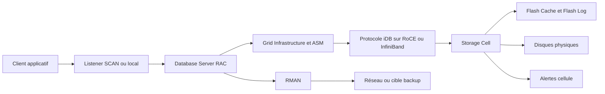

    # Module 02 — Architecture

    ## 1. Objectif pédagogique

    Décrire l’architecture technique Exadata : DB servers, storage cells, ASM, GI et réseau privé. Le chapitre vise une compréhension opérationnelle et théorique : l’étudiant doit pouvoir expliquer le mécanisme, reconnaître les composants impliqués, lire les principales vues ou commandes et résoudre un cas d’école sans modifier l’environnement.

    ## 2. Pourquoi ce sujet est important

    L’architecture Exadata sépare les rôles : les DB servers exécutent SQL et instances, les storage cells stockent et optimisent les I/O, ASM fournit la couche volume Oracle et le réseau privé transporte les blocs ou résultats filtrés.

    . Une requête SQL peut dépendre du plan d’exécution, du cache flash, de la configuration ASM, de l’état d’une cell et du réseau privé. Ce chapitre montre donc le sujet comme un mécanisme technique, pas comme une simple procédure administrative.

    ## 3. Concepts clés expliqués

    | Concept | Définition claire | Exemple concret |
    |---|---|---|
    | **RAC** | Oracle Real Application Clusters permet à plusieurs instances d’accéder à la même base via un cluster. | Deux DB servers peuvent héberger deux instances d’une même base. |
| **ASM** | Automatic Storage Management répartit les fichiers Oracle sur des disques ASM issus des grid disks Exadata. | Les diskgroups DATA et RECO consomment des grid disks créés dans les cells. |
| **Interconnect privé** | Réseau RoCE ou InfiniBand utilisé pour le trafic cluster et les échanges rapides entre DB servers et cells. | Un problème de fabric peut produire de la latence I/O ou des symptômes RAC. |

    Ces concepts doivent être étudiés ensemble. Par exemple, **RAC** n’a pas la même signification isolément que dans une architecture RAC, ASM et storage cells. La compréhension vient de la relation entre objet Oracle, ressource Exadata et workload applicatif.

    ## 4. Architecture concernée

    | Composant | Rôle dans ce chapitre |
    |---|---|
    | Database servers | Exécutent les instances, services, agents et outils Oracle liés au module. |
| Storage cells | Apportent stockage intelligent, flash, offload, alertes ou métriques lorsque le sujet touche les I/O. |
| ASM / Grid Infrastructure | Fournissent cluster, diskgroups, ressources RAC et accès aux fichiers Oracle. |
| Réseau RoCE / InfiniBand | Transporte les échanges internes rapides et peut influencer latence et disponibilité. |
| Outils Oracle | Enterprise Manager, AHF, Exachk, TFA, RMAN ou Data Guard selon le thème étudié. |

    Les diagrammes associés au chapitre sont :

    - [`architecture-globale-exadata.mmd`](../diagrams/architecture-globale-exadata.mmd)
- [`physical-cell-grid-asm.mmd`](../diagrams/physical-cell-grid-asm.mmd)
- [`reseau-client-admin-backup-interconnect.mmd`](../diagrams/reseau-client-admin-backup-interconnect.mmd)

    ## 5. Fonctionnement détaillé

    L’architecture Exadata sépare les rôles : les DB servers exécutent SQL et instances, les storage cells stockent et optimisent les I/O, ASM fournit la couche volume Oracle et le réseau privé transporte les blocs ou résultats filtrés.

    . Au niveau **base de données**, Oracle produit un plan d’exécution, gère les sessions, écrit les redo et consulte les vues dynamiques. Au niveau **cluster et stockage**, Grid Infrastructure et ASM rendent disponibles les fichiers de base sur les diskgroups. Au niveau **Exadata**, les storage cells, le cache flash, les métriques et le logiciel système influencent directement le débit, la latence et parfois le volume de données transmis aux DB servers.

    Pour ce module, les notions centrales sont **RAC, ASM, Interconnect privé**. Elles déterminent la façon dont le composant réagit à une charge réelle. Une bonne lecture technique consiste à comprendre d’abord le chemin suivi par l’opération, puis les conditions qui rendent le mécanisme efficace ou inefficace. Une mauvaise lecture consiste à supposer que la plateforme corrige automatiquement un mauvais modèle de données, une requête mal écrite ou une architecture réseau incomplète.

    ## 6. Exemple concret

    Un incident de performance peut provenir du plan SQL, d’ASM, d’une cell saturée ou du réseau privé ; le chapitre montre comment chaque couche intervient.

    Dans ce scénario, l’analyse commence par le symptôme métier, puis remonte vers la couche Oracle concernée. Si le sujet touche les I/O, il faut différencier le temps passé dans Oracle Database, les attentes liées aux cells, la distribution ASM et la santé des storage cells. Si le sujet touche la haute disponibilité, il faut distinguer disponibilité locale RAC, continuité de service, sauvegarde et reprise après sinistre.

    ## 7. Commandes, vues et métriques utiles

    Les commandes ci-dessous sont données comme exemples de lecture. Elles doivent être adaptées aux noms de bases, privilèges, versions et conventions du site.

    ```bash
    crsctl stat res -t
srvctl status database -d <db_unique_name> -v
select instance_name,status,host_name from gv$instance;
    ```

    | Élément à lire | Interprétation |
    |---|---|
    | RAC | Cette information indique comment le mécanisme RAC se comporte dans un cas réel. Elle doit être lue avec le contexte de charge, de version et d’architecture. |
| ASM | Cette information indique comment le mécanisme ASM se comporte dans un cas réel. Elle doit être lue avec le contexte de charge, de version et d’architecture. |
| Interconnect privé | Cette information indique comment le mécanisme Interconnect privé se comporte dans un cas réel. Elle doit être lue avec le contexte de charge, de version et d’architecture. |

    ## 8. Interprétation des résultats

    L’interprétation doit répondre à une question technique précise. Une valeur isolée ne suffit pas : une latence se compare à une période comparable, un volume d’I/O se compare à un plan SQL et un état RAC se compare au placement attendu des services. Les métriques Exadata sont particulièrement utiles lorsqu’elles expliquent pourquoi un volume important de données a été lu, filtré, renvoyé ou retardé.

    Dans les chapitres performance, les valeurs liées aux bytes, événements `cell`, AWR ou ASH indiquent le chemin dominant. Dans les chapitres HA/DR, les états de rôle, lag, services et ressources cluster décrivent la capacité réelle à basculer ou maintenir le service. Dans les chapitres support et maintenance, les rapports AHF, Exachk ou TFA doivent être lus comme des aides structurées, pas comme des remplacements de raisonnement.

    ## 9. Erreurs fréquentes

    | Erreur | Cause probable | Correction pédagogique |
    |---|---|---|
    | Confondre symptôme et cause | Le premier message visible vient parfois d’une couche différente de la cause réelle. | Reconstituer le chemin technique avant de conclure. |
    | Appliquer une recette générique | Exadata dépend fortement du workload, du plan SQL, de la version et du modèle de service. | Relire les composants du chapitre et adapter le diagnostic. |
    | Ignorer les dépendances | Une base RAC dépend de GI, ASM, réseau privé et storage cells. | Vérifier les dépendances avant toute hypothèse. |
    | Oublier les limites du mécanisme | Certaines fonctions Exadata ne s’appliquent pas à tous les accès ou toutes les charges. | Identifier les conditions d’éligibilité et les cas d’exclusion. |

    ## 10. Bonnes pratiques

    | Bonne pratique | Application concrète |
    |---|---|
    | Partir du mécanisme | Dessiner le chemin DB → ASM → cell → réseau → retour résultat selon le sujet. |
    | Séparer lecture et changement | Les commandes de lecture servent à comprendre ; les changements exigent runbook et validation. |
    | Comparer avec un état de référence | Une valeur a du sens lorsqu’elle est rapprochée d’une période saine ou d’une cible prévue. |
    | Documenter la version | Les fonctionnalités et commandes peuvent varier selon génération Exadata et version Oracle. |

    ## 11. Exercice pratique

    Vous êtes responsable du sujet **Architecture** sur une plateforme Exadata de formation. À partir du scénario suivant, rédigez une analyse de deux pages :

    > Un incident de performance peut provenir du plan SQL, d’ASM, d’une cell saturée ou du réseau privé ; le chapitre montre comment chaque couche intervient.

    Votre réponse doit inclure un schéma simple des composants impliqués, trois commandes ou vues à exécuter, deux métriques à lire, les erreurs à éviter et une recommandation finale.

    ## 12. Corrigé de l’exercice

    Une bonne réponse commence par identifier les composants du chapitre : **RAC, ASM, Interconnect privé**. Elle explique ensuite le chemin technique suivi par l’opération et indique pourquoi les commandes proposées permettent de vérifier ce chemin. Les commandes attendues sont celles de la section 7, adaptées aux noms réels de l’environnement.

    Le corrigé doit aussi distinguer les observations et les décisions. Par exemple, constater un lag, une alerte cell, un volume `eligible bytes` ou une ressource CRS offline ne suffit pas : il faut expliquer la conséquence sur l’application, la disponibilité ou la performance.  : optimisation SQL, ajustement de plan de ressources, revue réseau, ouverture SR, test de restore ou préparation CAB selon le module.

    ## 13. Synthèse à retenir

    ```text
    À retenir
    - Architecture  : base, cluster, ASM, storage cells, réseau et outils Oracle.
    - Les notions centrales du chapitre sont : RAC, ASM, Interconnect privé.
    - Les commandes de lecture permettent de comprendre le mécanisme avant toute action de changement.
    - Les erreurs les plus coûteuses viennent d’une lecture isolée d’une seule couche.
    - Un bon administrateur Exadata relie toujours architecture, workload, métriques et impact métier.
    ```


## Références officielles

| Référence | Utilisation dans le module |
|---|---|
| [Oracle University — Exadata Database Machine Administration Workshop](https://education.oracle.com/exadata-database-machine-administration-workshop/courP_4599) | Cadre pédagogique général du workshop. |
| [Oracle Exadata Documentation](https://docs.oracle.com/en/engineered-systems/exadata-database-machine/) | Administration Exadata, Storage Server, CellCLI, maintenance et monitoring. |
| [Oracle Database Documentation](https://docs.oracle.com/en/database/) | Vues dynamiques, SQL, RMAN, Data Guard, AWR/ASH selon licences. |
| [Oracle Maximum Availability Architecture](https://www.oracle.com/database/technologies/high-availability/maa.html) | Principes HA/DR, Data Guard, sauvegarde et continuité de service. |
| [Oracle Autonomous Health Framework](https://docs.oracle.com/en/engineered-systems/health-diagnostics/autonomous-health-framework/) | AHF, Exachk, ORAchk, TFA et diagnostics automatisés. |
## Complément expert V5 — Architecture Exadata de bout en bout

### Explication technique spécifique

Oracle Exadata Database Machine est une plate-forme intégrée pour bases Oracle qui associe **database servers**, **storage servers**, réseau interne à faible latence, Oracle Grid Infrastructure, ASM, Exadata System Software et outils d’administration. La différence fondamentale avec une architecture Oracle classique ne tient pas seulement à la puissance des serveurs. Dans une architecture classique, la base lit des blocs depuis un SAN ou un NAS, puis filtre, joint et agrège les données côté moteur SQL. Dans Exadata, une partie du travail est déplacée vers les **storage cells** : les cellules peuvent appliquer des prédicats, projeter des colonnes, éliminer des régions de stockage et retourner un volume réduit de données vers les database servers. C’est cette coopération entre moteur SQL, ASM, protocole iDB et cellules qui donne à Exadata son caractère d’appliance intégrée.[^v5-exadata-overview]

Les **database servers** hébergent les instances Oracle RAC ou single instance, les processus foreground/background, le cache buffer, le shared pool, les processus ASM et Clusterware. Les **storage cells** hébergent Exadata System Software, présentent des grid disks à ASM, gèrent les disques physiques, les périphériques flash, les métriques cellule et les fonctions d’offload. Le réseau client expose les services SQL aux applications. Le réseau d’administration sert au pilotage, à la supervision et aux opérations d’infrastructure. Le réseau de backup transporte généralement les flux RMAN vers les appliances ou serveurs de sauvegarde. L’interconnect RoCE ou InfiniBand transporte le trafic RAC, ASM et iDB ; il conditionne directement la latence entre les instances et les cellules.

| Couche | Architecture Oracle classique | Exadata |
|---|---|---|
| Calcul SQL | Serveurs Oracle lisant des blocs depuis stockage externe | Database servers RAC coopérant avec storage cells |
| Stockage | SAN/NAS exposant LUN ou volumes | Cell disks, grid disks et ASM diskgroups pilotés par Exadata System Software |
| Filtrage | Majoritairement côté instance Oracle | Offload possible côté cellule avec Smart Scan |
| Réseau interne | Fibre Channel, Ethernet ou fabric SAN séparé | RoCE ou InfiniBand pour RAC, ASM et iDB |
| Supervision | Outils base + stockage souvent séparés | Enterprise Manager, cellcli, métriques Exadata et alertes cellule |
| Résilience | Dépend fortement du design SAN et du cluster | Redondance ASM, failure groups, cellules multiples, MAA et automatisation support |

Le chemin d’une requête SQL commence par le client, traverse le listener, atteint une instance sur un database server, est optimisé par le moteur SQL, puis accède aux segments via ASM. Si les conditions sont réunies, l’accès aux blocs est transformé en requêtes iDB vers les storage cells. Les cellules lisent disques et flash, appliquent les opérations offloadables, puis renvoient des lignes ou colonnes filtrées. Le chemin d’une I/O non offloadable est plus proche d’une lecture de blocs classique : l’instance demande des extents ASM et reçoit des blocs à traiter côté database server. Le chemin d’un backup RMAN lit les datafiles via ASM, écrit vers RECO, un média manager ou un réseau de backup. Le chemin d’une alerte naît souvent dans une cellule, un serveur, un switch ou un composant logiciel, puis remonte vers Exadata System Software, Enterprise Manager, ASR ou les journaux de diagnostic.



### Exemple concret réaliste

Une requête analytique lit une table de ventes partitionnée sur plusieurs années avec un prédicat sur `sales_date` et `region_id`. Sur SAN classique, la base peut devoir lire un grand nombre de blocs, les transférer au database server, puis filtrer. Sur Exadata, si le plan utilise un full scan direct path et si les prédicats sont offloadables, les storage cells peuvent éliminer des lignes et ne renvoyer que les colonnes utiles. Une statistique SQL Monitor typique montrera alors une différence entre **cell physical IO bytes eligible for predicate offload**, **cell physical IO interconnect bytes** et **physical read bytes**. Si l’interconnect reçoit beaucoup moins d’octets que les cellules n’en lisent, le gain provient de l’offload et non d’un simple cache.

### Comment raisonner

Pour analyser une architecture Exadata, il faut suivre les flux et non seulement lister les composants. Une question SQL se raisonne en quatre chemins : le chemin client vers l’instance, le chemin instance vers ASM, le chemin ASM/iDB vers les cellules et le chemin retour des données filtrées. Une question de disponibilité se raisonne par domaine de panne : database server, cellule, switch, disque, flash, power distribution unit, réseau client ou réseau d’administration. Une question de performance se raisonne par réduction des données transférées, latence interconnect, efficacité flash, concurrence I/O et placement ASM.

### Commandes / vues utiles

```bash
# Read-only : inventaire cellule et métriques principales
cellcli -e "list cell detail"
cellcli -e "list griddisk attributes name,asmmodestatus,asmdeactivationoutcome,size"
cellcli -e "list metriccurrent where objectType = 'CELL' attributes name,metricValue"

# Read-only : vision ASM
asmcmd lsdg
asmcmd lsdsk -p
```

```sql
-- Read-only : repérer services, instances et environnement RAC
select inst_id, instance_name, host_name, status from gv$instance order by inst_id;
select name, value from v$parameter where name in ('cluster_database','db_unique_name');
select name, total_mb, free_mb, type, state from v$asm_diskgroup order by name;
```

### Comment interpréter

Une architecture Exadata saine se reconnaît par la cohérence entre les couches. Les diskgroups ASM doivent voir les grid disks attendus, les cellules doivent être en état normal, les chemins réseau ne doivent pas montrer d’erreurs persistantes, et les plans SQL candidats doivent produire des métriques d’offload lorsqu’ils remplissent les conditions. Un manque d’offload sur une requête n’est pas automatiquement une anomalie : index access, fonctions non offloadables, types de données, chiffrement, statistiques ou choix de plan peuvent expliquer que le moteur reste côté database server.

### Exercice pratique

Explique pourquoi Exadata réduit certaines I/O par rapport à une architecture SAN classique. Construis une réponse qui distingue la quantité lue sur disque, la quantité transférée sur l’interconnect et la quantité réellement consommée par le moteur SQL.

### Corrigé détaillé

Exadata ne réduit pas toutes les I/O de façon magique. Il réduit certaines I/O **vues par le database server** parce que les storage cells peuvent exécuter une partie du travail au plus près des données. Si une table scan est éligible au Smart Scan, les cellules lisent les extents ASM, appliquent les prédicats offloadables et renvoient uniquement les lignes et colonnes nécessaires. Le disque ou la flash peut donc lire un volume important, mais l’interconnect transporte un volume inférieur. Dans une architecture SAN classique, le SAN renvoie principalement des blocs ; le database server doit ensuite filtrer. La bonne réponse doit donc distinguer les bytes lus physiquement, les bytes éligibles à l’offload et les bytes renvoyés sur l’interconnect. La réduction provient de l’intelligence des cellules, du protocole iDB, du stockage ASM distribué et des optimisations Exadata System Software, pas seulement de disques plus rapides.

### Limites et pièges

Le piège le plus courant consiste à attribuer toute amélioration à Smart Scan. Une requête peut être rapide parce que les données sont dans Flash Cache, parce que le plan utilise un index sélectif, parce que la partition pruning fonctionne ou parce que le jeu de données est déjà en cache. À l’inverse, une requête peut ne pas offloader malgré Exadata si elle utilise des fonctions non éligibles, des accès indexés très sélectifs ou des opérations qui imposent un traitement côté instance. L’architecture doit donc être lue avec SQL Monitor, les statistiques cellule, ASM et les métriques réseau.

### À retenir

Exadata est une architecture coopérative. Les database servers exécutent SQL et RAC, les storage cells exécutent stockage et offload, ASM orchestre les extents et les diskgroups, et le réseau interne relie ces couches. Apprendre Exadata consiste à comprendre les chemins réels d’une requête, d’une I/O, d’un backup et d’une alerte.

[^v5-exadata-overview]: Oracle, *Oracle Exadata Database Machine System Overview*, https://docs.oracle.com/en/engineered-systems/exadata-database-machine/
