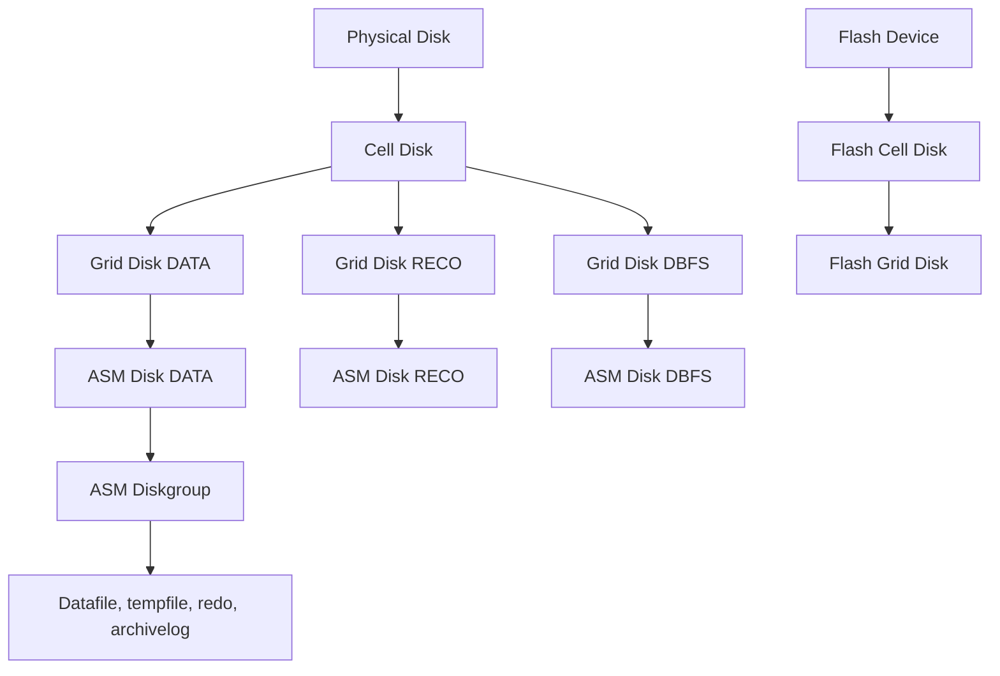

    # Module 06 — Exadata Storage Server Configuration

    ## 1. Objectif pédagogique

    Apprendre le modèle des storage cells, objets CellCLI, disques, flash, alertes et métriques. Le chapitre vise une compréhension opérationnelle et théorique : l’étudiant doit pouvoir expliquer le mécanisme, reconnaître les composants impliqués, lire les principales vues ou commandes et résoudre un cas d’école sans modifier l’environnement.

    ## 2. Pourquoi ce sujet est important

    Les storage cells ne sont pas de simples tiroirs disques. Elles exécutent un logiciel capable de gérer flash, disques, offload SQL, métriques et alertes. CellCLI est l’interface principale d’administration côté cell.

    . Une requête SQL peut dépendre du plan d’exécution, du cache flash, de la configuration ASM, de l’état d’une cell et du réseau privé. Ce chapitre montre donc le sujet comme un mécanisme technique, pas comme une simple procédure administrative.

    ## 3. Concepts clés expliqués

    | Concept | Définition claire | Exemple concret |
    |---|---|---|
    | **Physical Disk** | Disque physique présent dans une storage cell, support matériel de capacité ou performance selon modèle. | Une alerte predictive failure concerne d’abord un physical disk. |
| **Cell Disk** | Objet logique créé à partir d’un physical disk et utilisé pour construire des grid disks. | Un disque physique peut correspondre à un cell disk. |
| **Grid Disk** | Portion de cell disk présentée à ASM comme disque utilisable. | ASM voit des chemins issus de grid disks DATA ou RECO. |

    Ces concepts doivent être étudiés ensemble. Par exemple, **Physical Disk** n’a pas la même signification isolément que dans une architecture RAC, ASM et storage cells. La compréhension vient de la relation entre objet Oracle, ressource Exadata et workload applicatif.

    ## 4. Architecture concernée

    | Composant | Rôle dans ce chapitre |
    |---|---|
    | Database servers | Exécutent les instances, services, agents et outils Oracle liés au module. |
| Storage cells | Apportent stockage intelligent, flash, offload, alertes ou métriques lorsque le sujet touche les I/O. |
| ASM / Grid Infrastructure | Fournissent cluster, diskgroups, ressources RAC et accès aux fichiers Oracle. |
| Réseau RoCE / InfiniBand | Transporte les échanges internes rapides et peut influencer latence et disponibilité. |
| Outils Oracle | Enterprise Manager, AHF, Exachk, TFA, RMAN ou Data Guard selon le thème étudié. |

    Les diagrammes associés au chapitre sont :

    - [`physical-cell-grid-asm.mmd`](../diagrams/physical-cell-grid-asm.mmd)

    ## 5. Fonctionnement détaillé

    Les storage cells ne sont pas de simples tiroirs disques. Elles exécutent un logiciel capable de gérer flash, disques, offload SQL, métriques et alertes. CellCLI est l’interface principale d’administration côté cell.

    . Au niveau **base de données**, Oracle produit un plan d’exécution, gère les sessions, écrit les redo et consulte les vues dynamiques. Au niveau **cluster et stockage**, Grid Infrastructure et ASM rendent disponibles les fichiers de base sur les diskgroups. Au niveau **Exadata**, les storage cells, le cache flash, les métriques et le logiciel système influencent directement le débit, la latence et parfois le volume de données transmis aux DB servers.

    Pour ce module, les notions centrales sont **Physical Disk, Cell Disk, Grid Disk**. Elles déterminent la façon dont le composant réagit à une charge réelle. Une bonne lecture technique consiste à comprendre d’abord le chemin suivi par l’opération, puis les conditions qui rendent le mécanisme efficace ou inefficace. Une mauvaise lecture consiste à supposer que la plateforme corrige automatiquement un mauvais modèle de données, une requête mal écrite ou une architecture réseau incomplète.

    ## 6. Exemple concret

    Une alerte disque apparaît ; il faut comprendre la chaîne physical disk → cell disk → grid disk → ASM avant de décider.

    Dans ce scénario, l’analyse commence par le symptôme métier, puis remonte vers la couche Oracle concernée. Si le sujet touche les I/O, il faut différencier le temps passé dans Oracle Database, les attentes liées aux cells, la distribution ASM et la santé des storage cells. Si le sujet touche la haute disponibilité, il faut distinguer disponibilité locale RAC, continuité de service, sauvegarde et reprise après sinistre.

    ## 7. Commandes, vues et métriques utiles

    Les commandes ci-dessous sont données comme exemples de lecture. Elles doivent être adaptées aux noms de bases, privilèges, versions et conventions du site.

    ```bash
    cellcli -e "list cell detail"
cellcli -e "list griddisk attributes name,status,asmmodestatus,asmdeactivationoutcome"
asmcmd lsdg
    ```

    | Élément à lire | Interprétation |
    |---|---|
    | Physical Disk | Cette information indique comment le mécanisme Physical Disk se comporte dans un cas réel. Elle doit être lue avec le contexte de charge, de version et d’architecture. |
| Cell Disk | Cette information indique comment le mécanisme Cell Disk se comporte dans un cas réel. Elle doit être lue avec le contexte de charge, de version et d’architecture. |
| Grid Disk | Cette information indique comment le mécanisme Grid Disk se comporte dans un cas réel. Elle doit être lue avec le contexte de charge, de version et d’architecture. |

    ## 8. Interprétation des résultats

    L’interprétation doit répondre à une question technique précise. Une valeur isolée ne suffit pas : une latence se compare à une période comparable, un volume d’I/O se compare à un plan SQL et un état RAC se compare au placement attendu des services. Les métriques Exadata sont particulièrement utiles lorsqu’elles expliquent pourquoi un volume important de données a été lu, filtré, renvoyé ou retardé.

    Dans les chapitres performance, les valeurs liées aux bytes, événements `cell`, AWR ou ASH indiquent le chemin dominant. Dans les chapitres HA/DR, les états de rôle, lag, services et ressources cluster décrivent la capacité réelle à basculer ou maintenir le service. Dans les chapitres support et maintenance, les rapports AHF, Exachk ou TFA doivent être lus comme des aides structurées, pas comme des remplacements de raisonnement.

    ## 9. Erreurs fréquentes

    | Erreur | Cause probable | Correction pédagogique |
    |---|---|---|
    | Confondre symptôme et cause | Le premier message visible vient parfois d’une couche différente de la cause réelle. | Reconstituer le chemin technique avant de conclure. |
    | Appliquer une recette générique | Exadata dépend fortement du workload, du plan SQL, de la version et du modèle de service. | Relire les composants du chapitre et adapter le diagnostic. |
    | Ignorer les dépendances | Une base RAC dépend de GI, ASM, réseau privé et storage cells. | Vérifier les dépendances avant toute hypothèse. |
    | Oublier les limites du mécanisme | Certaines fonctions Exadata ne s’appliquent pas à tous les accès ou toutes les charges. | Identifier les conditions d’éligibilité et les cas d’exclusion. |

    ## 10. Bonnes pratiques

    | Bonne pratique | Application concrète |
    |---|---|
    | Partir du mécanisme | Dessiner le chemin DB → ASM → cell → réseau → retour résultat selon le sujet. |
    | Séparer lecture et changement | Les commandes de lecture servent à comprendre ; les changements exigent runbook et validation. |
    | Comparer avec un état de référence | Une valeur a du sens lorsqu’elle est rapprochée d’une période saine ou d’une cible prévue. |
    | Documenter la version | Les fonctionnalités et commandes peuvent varier selon génération Exadata et version Oracle. |

    ## 11. Exercice pratique

    Vous êtes responsable du sujet **Exadata Storage Server Configuration** sur une plateforme Exadata de formation. À partir du scénario suivant, rédigez une analyse de deux pages :

    > Une alerte disque apparaît ; il faut comprendre la chaîne physical disk → cell disk → grid disk → ASM avant de décider.

    Votre réponse doit inclure un schéma simple des composants impliqués, trois commandes ou vues à exécuter, deux métriques à lire, les erreurs à éviter et une recommandation finale.

    ## 12. Corrigé de l’exercice

    Une bonne réponse commence par identifier les composants du chapitre : **Physical Disk, Cell Disk, Grid Disk**. Elle explique ensuite le chemin technique suivi par l’opération et indique pourquoi les commandes proposées permettent de vérifier ce chemin. Les commandes attendues sont celles de la section 7, adaptées aux noms réels de l’environnement.

    Le corrigé doit aussi distinguer les observations et les décisions. Par exemple, constater un lag, une alerte cell, un volume `eligible bytes` ou une ressource CRS offline ne suffit pas : il faut expliquer la conséquence sur l’application, la disponibilité ou la performance.  : optimisation SQL, ajustement de plan de ressources, revue réseau, ouverture SR, test de restore ou préparation CAB selon le module.

    ## 13. Synthèse à retenir

    ```text
    À retenir
    - Exadata Storage Server Configuration  : base, cluster, ASM, storage cells, réseau et outils Oracle.
    - Les notions centrales du chapitre sont : Physical Disk, Cell Disk, Grid Disk.
    - Les commandes de lecture permettent de comprendre le mécanisme avant toute action de changement.
    - Les erreurs les plus coûteuses viennent d’une lecture isolée d’une seule couche.
    - Un bon administrateur Exadata relie toujours architecture, workload, métriques et impact métier.
    ```


## Références officielles

| Référence | Utilisation dans le module |
|---|---|
| [Oracle University — Exadata Database Machine Administration Workshop](https://education.oracle.com/exadata-database-machine-administration-workshop/courP_4599) | Cadre pédagogique général du workshop. |
| [Oracle Exadata Documentation](https://docs.oracle.com/en/engineered-systems/exadata-database-machine/) | Administration Exadata, Storage Server, CellCLI, maintenance et monitoring. |
| [Oracle Database Documentation](https://docs.oracle.com/en/database/) | Vues dynamiques, SQL, RMAN, Data Guard, AWR/ASH selon licences. |
| [Oracle Maximum Availability Architecture](https://www.oracle.com/database/technologies/high-availability/maa.html) | Principes HA/DR, Data Guard, sauvegarde et continuité de service. |
| [Oracle Autonomous Health Framework](https://docs.oracle.com/en/engineered-systems/health-diagnostics/autonomous-health-framework/) | AHF, Exachk, ORAchk, TFA et diagnostics automatisés. |
## Complément expert V5 — Chaîne stockage cellule, disques et grid disks

### Explication technique spécifique

Une storage cell Exadata n’expose pas directement les disques physiques aux bases de données. Elle transforme les ressources matérielles en objets administrables : **physical disks** pour les disques réels, **flash devices** pour les cartes ou modules flash, **cell disks** comme abstraction locale créée sur ces périphériques, puis **grid disks** comme unités présentées à ASM. Cette chaîne explique pourquoi ASM ne voit pas les disques physiques : ASM consomme des grid disks publiés par les cellules, ce qui permet à Exadata System Software de gérer flash cache, métriques, alertes, offload et maintenance cellule avant que la couche ASM ne voie le stockage.[^v5-cell-admin]

Un **cell disk** correspond à une portion de disque ou de flash contrôlée par la cellule. Un **grid disk** est découpé dans un cell disk et affecté à un usage logique, souvent DATA, RECO ou DBFS. Les griddisks DATA hébergent les datafiles et tempfiles via ASM ; RECO héberge souvent fast recovery area, archivelogs et backups locaux ; DBFS peut porter des usages spécifiques comme staging ou fichiers partagés selon design. Les sparse diskgroups ajoutent une capacité de provisioning optimisée pour clones ou snapshots, mais ils exigent une discipline stricte car une saturation logique peut avoir des effets rapides.



### Exemple concret réaliste

Une cellule `cel01` contient douze disques haute capacité. Chaque disque est visible comme physical disk. Après configuration, la cellule crée des cell disks, puis des grid disks `DATA_CD_00_cel01`, `RECO_CD_00_cel01` et éventuellement `DBFS_CD_00_cel01`. ASM voit ces grid disks comme disques ASM, répartis dans des failure groups par cellule. Si un disque physique tombe en panne, la cellule marque les objets dépendants en erreur et ASM s’appuie sur la redondance du diskgroup pour maintenir l’accès aux fichiers. Si une cellule entière devient indisponible, tous les grid disks de son failure group disparaissent temporairement ; la capacité à survivre dépend du niveau de redondance ASM et de la distribution des extents.

### Comment raisonner

Le diagnostic stockage Exadata suit la chaîne physique vers logique. On commence par vérifier les physical disks et flash devices, puis les cell disks, puis les grid disks, puis l’état ASM. Si ASM signale un disque absent mais que la cellule voit le disque physique en bon état, l’anomalie peut être au niveau griddisk, permissions ASM, état de présentation ou communication. Si la cellule signale un predictive failure sur un disque, ASM peut encore être online grâce au mirroring ; il ne faut pas confondre survie logique et absence de risque matériel.

### Commandes / vues utiles

```bash
# Read-only : chaîne cellule complète
cellcli -e "list physicaldisk detail"
cellcli -e "list flashcache detail"
cellcli -e "list celldisk detail"
cellcli -e "list griddisk detail"
cellcli -e "list alerthistory attributes name,alertMessage,severity,beginTime"

# Read-only : vision ASM depuis Grid Infrastructure
asmcmd lsdg
asmcmd lsdsk -p
asmcmd lsdsk -k
```

```sql
-- Read-only : correspondance ASM et état des disques
select group_number, name, type, state, total_mb, free_mb from v$asm_diskgroup order by name;
select group_number, disk_number, name, path, mount_status, header_status, mode_status, state from v$asm_disk order by group_number, disk_number;
```

### Comment interpréter

`list physicaldisk detail` répond à la question matérielle : le disque ou la flash existe-t-il et dans quel état matériel se trouve-t-il ? `list celldisk detail` répond à la question d’abstraction locale : la cellule a-t-elle correctement créé et exposé sa couche interne ? `list griddisk detail` répond à la question de présentation à ASM : les objets logiques sont-ils actifs, synchrones et associés au bon usage ? `asmcmd lsdg` répond à la question base : les diskgroups disposent-ils de capacité et de redondance suffisantes ? Une divergence entre ces niveaux est souvent le point de départ du diagnostic.

### Exercice pratique

On observe qu’un diskgroup ASM DATA reste monté, mais `cellcli` signale un disque physique en predictive failure sur une cellule. Explique pourquoi la base peut continuer à fonctionner et quelles vérifications read-only effectuer avant toute action corrective.

### Corrigé détaillé

La base peut continuer à fonctionner parce qu’ASM ne dépend pas d’un seul disque physique ; il s’appuie sur des extents répartis et miroités entre failure groups. Si le diskgroup est en normal redundancy ou high redundancy, la perte d’un disque peut être absorbée tant que les copies nécessaires restent accessibles sur d’autres failure groups. Il faut vérifier l’état du physical disk, le statut des cell disks et grid disks associés, l’état ASM des disques, la capacité libre et l’existence d’alertes. Les commandes read-only pertinentes sont `cellcli -e "list physicaldisk detail"`, `cellcli -e "list celldisk detail"`, `cellcli -e "list griddisk detail"`, `asmcmd lsdg` et une requête sur `v$asm_disk`. Le corrigé est correct parce qu’il sépare le symptôme matériel de la disponibilité logique assurée par ASM.

### Limites et pièges

Ne jamais interpréter `free_mb` ASM comme capacité immédiatement utilisable sans tenir compte de la redondance, du rebalance et du niveau de failure group. Ne pas confondre un disque ASM visible avec un disque physique sain. Ne pas exécuter de commandes de drop, recreate ou alter diskgroup dans un support pédagogique sans procédure Oracle validée. La V5 conserve donc uniquement des commandes de lecture.

### À retenir

La chaîne stockage Exadata est : physical disk ou flash device, cell disk, grid disk, ASM disk, ASM diskgroup, puis fichiers Oracle. Le diagnostic expert consiste à localiser précisément le niveau où l’état diverge.

[^v5-cell-admin]: Oracle, *Oracle Exadata System Software User's Guide — CellCLI and Storage Server Administration*, https://docs.oracle.com/en/engineered-systems/exadata-database-machine/sagug/
