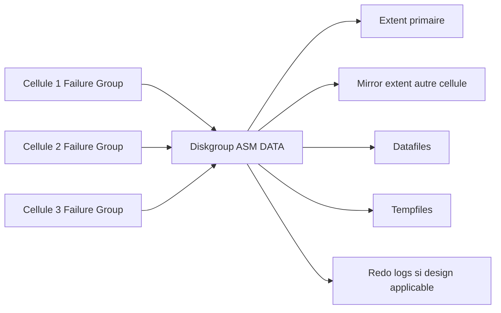

    # Module 07 — ASM et modèle de stockage

    ## 1. Objectif pédagogique

    Expliquer comment ASM consomme les grid disks Exadata et assure redondance et équilibrage. Le chapitre vise une compréhension opérationnelle et théorique : l’étudiant doit pouvoir expliquer le mécanisme, reconnaître les composants impliqués, lire les principales vues ou commandes et résoudre un cas d’école sans modifier l’environnement.

    ## 2. Pourquoi ce sujet est important

    ASM transforme les ressources fournies par les cells en stockage Oracle cohérent. La redondance n’est pas seulement une question d’espace ; elle dépend de la distribution sur les failure groups.

    . Une requête SQL peut dépendre du plan d’exécution, du cache flash, de la configuration ASM, de l’état d’une cell et du réseau privé. Ce chapitre montre donc le sujet comme un mécanisme technique, pas comme une simple procédure administrative.

    ## 3. Concepts clés expliqués

    | Concept | Définition claire | Exemple concret |
    |---|---|---|
    | **Diskgroup ASM** | Ensemble de disques ASM contenant fichiers Oracle, redo, datafiles, controlfiles ou FRA selon usage. | DATA contient souvent les fichiers de données ; RECO contient recovery area selon conception. |
| **Failure group** | Groupe de défaillance utilisé par ASM pour placer les copies sur des domaines distincts. | Les grid disks de cells différentes constituent des domaines de panne. |
| **Rebalance** | Répartition automatique des extents ASM après ajout, retrait ou retour d’un disque. | Après remplacement disque, ASM peut rééquilibrer les extents. |

    Ces concepts doivent être étudiés ensemble. Par exemple, **Diskgroup ASM** n’a pas la même signification isolément que dans une architecture RAC, ASM et storage cells. La compréhension vient de la relation entre objet Oracle, ressource Exadata et workload applicatif.

    ## 4. Architecture concernée

    | Composant | Rôle dans ce chapitre |
    |---|---|
    | Database servers | Exécutent les instances, services, agents et outils Oracle liés au module. |
| Storage cells | Apportent stockage intelligent, flash, offload, alertes ou métriques lorsque le sujet touche les I/O. |
| ASM / Grid Infrastructure | Fournissent cluster, diskgroups, ressources RAC et accès aux fichiers Oracle. |
| Réseau RoCE / InfiniBand | Transporte les échanges internes rapides et peut influencer latence et disponibilité. |
| Outils Oracle | Enterprise Manager, AHF, Exachk, TFA, RMAN ou Data Guard selon le thème étudié. |

    Les diagrammes associés au chapitre sont :

    - [`physical-cell-grid-asm.mmd`](../diagrams/physical-cell-grid-asm.mmd)

    ## 5. Fonctionnement détaillé

    ASM transforme les ressources fournies par les cells en stockage Oracle cohérent. La redondance n’est pas seulement une question d’espace ; elle dépend de la distribution sur les failure groups.

    . Au niveau **base de données**, Oracle produit un plan d’exécution, gère les sessions, écrit les redo et consulte les vues dynamiques. Au niveau **cluster et stockage**, Grid Infrastructure et ASM rendent disponibles les fichiers de base sur les diskgroups. Au niveau **Exadata**, les storage cells, le cache flash, les métriques et le logiciel système influencent directement le débit, la latence et parfois le volume de données transmis aux DB servers.

    Pour ce module, les notions centrales sont **Diskgroup ASM, Failure group, Rebalance**. Elles déterminent la façon dont le composant réagit à une charge réelle. Une bonne lecture technique consiste à comprendre d’abord le chemin suivi par l’opération, puis les conditions qui rendent le mécanisme efficace ou inefficace. Une mauvaise lecture consiste à supposer que la plateforme corrige automatiquement un mauvais modèle de données, une requête mal écrite ou une architecture réseau incomplète.

    ## 6. Exemple concret

    Après une alerte griddisk, l’équipe veut savoir si DATA conserve assez de capacité utilisable et si un rebalance est actif.

    Dans ce scénario, l’analyse commence par le symptôme métier, puis remonte vers la couche Oracle concernée. Si le sujet touche les I/O, il faut différencier le temps passé dans Oracle Database, les attentes liées aux cells, la distribution ASM et la santé des storage cells. Si le sujet touche la haute disponibilité, il faut distinguer disponibilité locale RAC, continuité de service, sauvegarde et reprise après sinistre.

    ## 7. Commandes, vues et métriques utiles

    Les commandes ci-dessous sont données comme exemples de lecture. Elles doivent être adaptées aux noms de bases, privilèges, versions et conventions du site.

    ```bash
    cellcli -e "list cell detail"
cellcli -e "list griddisk attributes name,status,asmmodestatus,asmdeactivationoutcome"
asmcmd lsdg
    ```

    | Élément à lire | Interprétation |
    |---|---|
    | Diskgroup ASM | Cette information indique comment le mécanisme Diskgroup ASM se comporte dans un cas réel. Elle doit être lue avec le contexte de charge, de version et d’architecture. |
| Failure group | Cette information indique comment le mécanisme Failure group se comporte dans un cas réel. Elle doit être lue avec le contexte de charge, de version et d’architecture. |
| Rebalance | Cette information indique comment le mécanisme Rebalance se comporte dans un cas réel. Elle doit être lue avec le contexte de charge, de version et d’architecture. |

    ## 8. Interprétation des résultats

    L’interprétation doit répondre à une question technique précise. Une valeur isolée ne suffit pas : une latence se compare à une période comparable, un volume d’I/O se compare à un plan SQL et un état RAC se compare au placement attendu des services. Les métriques Exadata sont particulièrement utiles lorsqu’elles expliquent pourquoi un volume important de données a été lu, filtré, renvoyé ou retardé.

    Dans les chapitres performance, les valeurs liées aux bytes, événements `cell`, AWR ou ASH indiquent le chemin dominant. Dans les chapitres HA/DR, les états de rôle, lag, services et ressources cluster décrivent la capacité réelle à basculer ou maintenir le service. Dans les chapitres support et maintenance, les rapports AHF, Exachk ou TFA doivent être lus comme des aides structurées, pas comme des remplacements de raisonnement.

    ## 9. Erreurs fréquentes

    | Erreur | Cause probable | Correction pédagogique |
    |---|---|---|
    | Confondre symptôme et cause | Le premier message visible vient parfois d’une couche différente de la cause réelle. | Reconstituer le chemin technique avant de conclure. |
    | Appliquer une recette générique | Exadata dépend fortement du workload, du plan SQL, de la version et du modèle de service. | Relire les composants du chapitre et adapter le diagnostic. |
    | Ignorer les dépendances | Une base RAC dépend de GI, ASM, réseau privé et storage cells. | Vérifier les dépendances avant toute hypothèse. |
    | Oublier les limites du mécanisme | Certaines fonctions Exadata ne s’appliquent pas à tous les accès ou toutes les charges. | Identifier les conditions d’éligibilité et les cas d’exclusion. |

    ## 10. Bonnes pratiques

    | Bonne pratique | Application concrète |
    |---|---|
    | Partir du mécanisme | Dessiner le chemin DB → ASM → cell → réseau → retour résultat selon le sujet. |
    | Séparer lecture et changement | Les commandes de lecture servent à comprendre ; les changements exigent runbook et validation. |
    | Comparer avec un état de référence | Une valeur a du sens lorsqu’elle est rapprochée d’une période saine ou d’une cible prévue. |
    | Documenter la version | Les fonctionnalités et commandes peuvent varier selon génération Exadata et version Oracle. |

    ## 11. Exercice pratique

    Vous êtes responsable du sujet **ASM et modèle de stockage** sur une plateforme Exadata de formation. À partir du scénario suivant, rédigez une analyse de deux pages :

    > Après une alerte griddisk, l’équipe veut savoir si DATA conserve assez de capacité utilisable et si un rebalance est actif.

    Votre réponse doit inclure un schéma simple des composants impliqués, trois commandes ou vues à exécuter, deux métriques à lire, les erreurs à éviter et une recommandation finale.

    ## 12. Corrigé de l’exercice

    Une bonne réponse commence par identifier les composants du chapitre : **Diskgroup ASM, Failure group, Rebalance**. Elle explique ensuite le chemin technique suivi par l’opération et indique pourquoi les commandes proposées permettent de vérifier ce chemin. Les commandes attendues sont celles de la section 7, adaptées aux noms réels de l’environnement.

    Le corrigé doit aussi distinguer les observations et les décisions. Par exemple, constater un lag, une alerte cell, un volume `eligible bytes` ou une ressource CRS offline ne suffit pas : il faut expliquer la conséquence sur l’application, la disponibilité ou la performance.  : optimisation SQL, ajustement de plan de ressources, revue réseau, ouverture SR, test de restore ou préparation CAB selon le module.

    ## 13. Synthèse à retenir

    ```text
    À retenir
    - ASM et modèle de stockage  : base, cluster, ASM, storage cells, réseau et outils Oracle.
    - Les notions centrales du chapitre sont : Diskgroup ASM, Failure group, Rebalance.
    - Les commandes de lecture permettent de comprendre le mécanisme avant toute action de changement.
    - Les erreurs les plus coûteuses viennent d’une lecture isolée d’une seule couche.
    - Un bon administrateur Exadata relie toujours architecture, workload, métriques et impact métier.
    ```


## Références officielles

| Référence | Utilisation dans le module |
|---|---|
| [Oracle University — Exadata Database Machine Administration Workshop](https://education.oracle.com/exadata-database-machine-administration-workshop/courP_4599) | Cadre pédagogique général du workshop. |
| [Oracle Exadata Documentation](https://docs.oracle.com/en/engineered-systems/exadata-database-machine/) | Administration Exadata, Storage Server, CellCLI, maintenance et monitoring. |
| [Oracle Database Documentation](https://docs.oracle.com/en/database/) | Vues dynamiques, SQL, RMAN, Data Guard, AWR/ASH selon licences. |
| [Oracle Maximum Availability Architecture](https://www.oracle.com/database/technologies/high-availability/maa.html) | Principes HA/DR, Data Guard, sauvegarde et continuité de service. |
| [Oracle Autonomous Health Framework](https://docs.oracle.com/en/engineered-systems/health-diagnostics/autonomous-health-framework/) | AHF, Exachk, ORAchk, TFA et diagnostics automatisés. |
## Complément expert V5 — ASM, failure groups et résilience Exadata

### Explication technique spécifique

ASM est la couche qui transforme les grid disks fournis par les cellules en diskgroups utilisables par Oracle Database. Dans Exadata, les failure groups correspondent généralement aux storage cells. Cette organisation est essentielle : ASM place les copies d’extents dans des failure groups distincts afin qu’une panne de disque ou de cellule ne rende pas immédiatement un fichier illisible. En normal redundancy, ASM maintient deux copies ; en high redundancy, il maintient trois copies. Le choix dépend du niveau de protection recherché, de la capacité utile attendue et du design MAA.[^v5-asm-admin]

Un diskgroup DATA porte les fichiers actifs de la base, RECO porte souvent la fast recovery area, les archivelogs, flashback logs ou backups locaux, et DBFS peut servir à des usages de fichiers partagés. Un sparse diskgroup sert à des clones ou snapshots économes en espace ; il doit être surveillé plus finement parce que la consommation réelle peut augmenter avec les écritures différentielles. Le **rebalance ASM** intervient lorsqu’un disque, grid disk ou failure group change d’état ou de capacité. Le **disk repair timer** permet d’éviter de reconstruire immédiatement des extents si une panne est temporaire ; il limite les mouvements inutiles lors d’incidents courts.



### Exemple concret réaliste

Un cluster Exadata dispose de trois storage cells et d’un diskgroup DATA en normal redundancy. ASM place une copie primaire d’un extent sur un grid disk de `cel01` et une copie miroir sur `cel02` ou `cel03`. Si `cel01` est indisponible, les lectures peuvent continuer via les copies miroirs. Lorsque la cellule revient avant expiration du repair timer, ASM peut resynchroniser au lieu de reconstruire l’ensemble. Si la cellule ne revient pas, ASM rééquilibre les extents sur les ressources restantes, avec une consommation d’I/O qui doit être surveillée.

### Comment raisonner

Le raisonnement ASM doit répondre à quatre questions : quel diskgroup est concerné, quel niveau de redondance est actif, quel failure group porte l’anomalie et quel impact le rebalance aura sur les workloads. Une alerte de disque n’a pas la même portée selon que le diskgroup est normal ou high redundancy, selon le nombre de cellules restantes, et selon la capacité libre. Le diagnostic ne doit pas partir d’une commande corrective ; il doit partir d’une lecture de `v$asm_diskgroup`, `v$asm_disk`, `asmcmd lsdg` et des états cellule.

### Commandes / vues utiles

```bash
# Read-only : état des diskgroups et disques ASM
asmcmd lsdg
asmcmd lsdsk -p
asmcmd lsdsk -k
asmcmd lsattr -G DATA -l
```

```sql
-- Read-only : redondance, état, chemins et opérations ASM
select name, type, state, total_mb, free_mb, required_mirror_free_mb, usable_file_mb from v$asm_diskgroup order by name;
select name, failgroup, path, mount_status, header_status, mode_status, state from v$asm_disk order by failgroup, name;
select group_number, operation, state, power, actual, sofar, est_work, est_minutes from v$asm_operation;
```

### Comment interpréter

`required_mirror_free_mb` indique la capacité à conserver la redondance après incident ; il est plus significatif que `free_mb` seul. `usable_file_mb` tient compte du mirroring et donne une vision plus réaliste de la capacité utilisable. `v$asm_operation` permet de voir si un rebalance est actif ; un rebalance prolongé peut concurrencer les workloads, surtout si la puissance est élevée ou si l’environnement est déjà saturé. Les colonnes `mount_status`, `header_status` et `mode_status` aident à distinguer un disque absent, membre, candidate ou en problème d’accès.

### Exercice pratique

Un diskgroup DATA en normal redundancy affiche `free_mb` positif mais `usable_file_mb` très faible. Explique pourquoi ajouter des datafiles peut rester risqué.

### Corrigé détaillé

`free_mb` mesure l’espace brut libre dans le diskgroup. En normal redundancy, chaque extent doit être miroité dans un autre failure group ; l’espace réellement utilisable dépend donc de la capacité à placer les copies tout en respectant les règles de mirroring. `usable_file_mb` intègre cette contrainte et peut devenir faible alors que `free_mb` semble encore confortable. Ajouter des datafiles sur la base de `free_mb` seul peut provoquer une pression de capacité ou empêcher ASM de maintenir la redondance après panne. La réponse correcte cite donc `required_mirror_free_mb`, `usable_file_mb`, le niveau de redondance et la distribution entre failure groups.

### Limites et pièges

Ne pas conclure qu’un diskgroup est sain parce qu’il est monté. Un diskgroup peut être monté tout en ayant une marge de redondance insuffisante, un rebalance en cours ou des disques en état dégradé. Ne pas interpréter les sparse diskgroups comme de la capacité gratuite. Ne pas modifier la puissance de rebalance sans tenir compte de la fenêtre de charge.

### À retenir

ASM est la couche de résilience logique d’Exadata. Comprendre DATA, RECO, DBFS, sparse, failure groups, mirroring, repair timer et rebalance est indispensable pour diagnostiquer une panne de disque ou de cellule.

[^v5-asm-admin]: Oracle, *Oracle Automatic Storage Management Administrator's Guide*, https://docs.oracle.com/en/database/oracle/oracle-database/19/ostmg/
