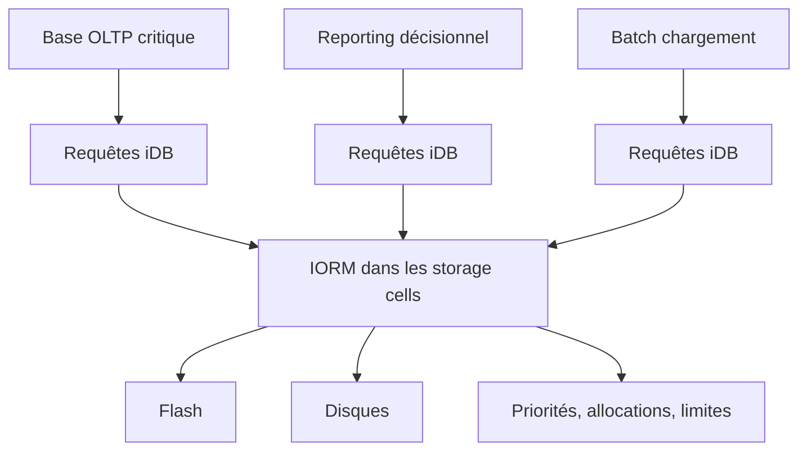

    # Module 08 — IORM

    ## 1. Objectif pédagogique

    Comprendre I/O Resource Management, l’isolation des workloads et les scénarios de consolidation. Le chapitre vise une compréhension opérationnelle et théorique : l’étudiant doit pouvoir expliquer le mécanisme, reconnaître les composants impliqués, lire les principales vues ou commandes et résoudre un cas d’école sans modifier l’environnement.

    ## 2. Pourquoi ce sujet est important

    IORM agit lorsque plusieurs workloads se disputent les I/O storage. Il complète Resource Manager : l’un gouverne les ressources Oracle côté base, l’autre influence l’accès aux I/O dans les cells.

    . Une requête SQL peut dépendre du plan d’exécution, du cache flash, de la configuration ASM, de l’état d’une cell et du réseau privé. Ce chapitre montre donc le sujet comme un mécanisme technique, pas comme une simple procédure administrative.

    ## 3. Concepts clés expliqués

    | Concept | Définition claire | Exemple concret |
    |---|---|---|
    | **IORM Plan** | Plan appliqué sur les storage cells pour allouer l’I/O entre bases, catégories ou workloads. | OLTP reçoit une priorité supérieure au reporting pendant les heures ouvrées. |
| **Noisy neighbor** | Workload qui consomme trop de ressources partagées et dégrade les autres. | Un batch de nuit déborde sur la journée et ralentit les transactions. |
| **Consumer Group** | Groupe Resource Manager côté database utilisé pour classifier des sessions. | Les sessions reporting peuvent être placées dans un groupe moins prioritaire. |

    Ces concepts doivent être étudiés ensemble. Par exemple, **IORM Plan** n’a pas la même signification isolément que dans une architecture RAC, ASM et storage cells. La compréhension vient de la relation entre objet Oracle, ressource Exadata et workload applicatif.

    ## 4. Architecture concernée

    | Composant | Rôle dans ce chapitre |
    |---|---|
    | Database servers | Exécutent les instances, services, agents et outils Oracle liés au module. |
| Storage cells | Apportent stockage intelligent, flash, offload, alertes ou métriques lorsque le sujet touche les I/O. |
| ASM / Grid Infrastructure | Fournissent cluster, diskgroups, ressources RAC et accès aux fichiers Oracle. |
| Réseau RoCE / InfiniBand | Transporte les échanges internes rapides et peut influencer latence et disponibilité. |
| Outils Oracle | Enterprise Manager, AHF, Exachk, TFA, RMAN ou Data Guard selon le thème étudié. |

    Les diagrammes associés au chapitre sont :

    - [`iorm-workload-isolation.mmd`](../diagrams/iorm-workload-isolation.mmd)

    ## 5. Fonctionnement détaillé

    IORM agit lorsque plusieurs workloads se disputent les I/O storage. Il complète Resource Manager : l’un gouverne les ressources Oracle côté base, l’autre influence l’accès aux I/O dans les cells.

    . Au niveau **base de données**, Oracle produit un plan d’exécution, gère les sessions, écrit les redo et consulte les vues dynamiques. Au niveau **cluster et stockage**, Grid Infrastructure et ASM rendent disponibles les fichiers de base sur les diskgroups. Au niveau **Exadata**, les storage cells, le cache flash, les métriques et le logiciel système influencent directement le débit, la latence et parfois le volume de données transmis aux DB servers.

    Pour ce module, les notions centrales sont **IORM Plan, Noisy neighbor, Consumer Group**. Elles déterminent la façon dont le composant réagit à une charge réelle. Une bonne lecture technique consiste à comprendre d’abord le chemin suivi par l’opération, puis les conditions qui rendent le mécanisme efficace ou inefficace. Une mauvaise lecture consiste à supposer que la plateforme corrige automatiquement un mauvais modèle de données, une requête mal écrite ou une architecture réseau incomplète.

    ## 6. Exemple concret

    Un traitement batch perturbe l’OLTP sur une plateforme consolidée ; le chapitre construit un plan de priorités.

    Dans ce scénario, l’analyse commence par le symptôme métier, puis remonte vers la couche Oracle concernée. Si le sujet touche les I/O, il faut différencier le temps passé dans Oracle Database, les attentes liées aux cells, la distribution ASM et la santé des storage cells. Si le sujet touche la haute disponibilité, il faut distinguer disponibilité locale RAC, continuité de service, sauvegarde et reprise après sinistre.

    ## 7. Commandes, vues et métriques utiles

    Les commandes ci-dessous sont données comme exemples de lecture. Elles doivent être adaptées aux noms de bases, privilèges, versions et conventions du site.

    ```bash
    cellcli -e list iormplan detail
select plan,group_or_subplan,mgmt_p1,mgmt_p2 from dba_rsrc_plan_directives;
select username,consumer_group from v$session where type=USER;
    ```

    | Élément à lire | Interprétation |
    |---|---|
    | IORM Plan | Cette information indique comment le mécanisme IORM Plan se comporte dans un cas réel. Elle doit être lue avec le contexte de charge, de version et d’architecture. |
| Noisy neighbor | Cette information indique comment le mécanisme Noisy neighbor se comporte dans un cas réel. Elle doit être lue avec le contexte de charge, de version et d’architecture. |
| Consumer Group | Cette information indique comment le mécanisme Consumer Group se comporte dans un cas réel. Elle doit être lue avec le contexte de charge, de version et d’architecture. |
| latence I/O par workload | Une hausse pour un workload moins prioritaire peut être normale si le plan protège un workload critique. |
| IORM plan actif | Confirme si une politique I/O existe réellement sur les cells. |

    ## 8. Interprétation des résultats

    L’interprétation doit répondre à une question technique précise. Une valeur isolée ne suffit pas : une latence se compare à une période comparable, un volume d’I/O se compare à un plan SQL et un état RAC se compare au placement attendu des services. Les métriques Exadata sont particulièrement utiles lorsqu’elles expliquent pourquoi un volume important de données a été lu, filtré, renvoyé ou retardé.

    Dans les chapitres performance, les valeurs liées aux bytes, événements `cell`, AWR ou ASH indiquent le chemin dominant. Dans les chapitres HA/DR, les états de rôle, lag, services et ressources cluster décrivent la capacité réelle à basculer ou maintenir le service. Dans les chapitres support et maintenance, les rapports AHF, Exachk ou TFA doivent être lus comme des aides structurées, pas comme des remplacements de raisonnement.

    ## 9. Erreurs fréquentes

    | Erreur | Cause probable | Correction pédagogique |
    |---|---|---|
    | Confondre symptôme et cause | Le premier message visible vient parfois d’une couche différente de la cause réelle. | Reconstituer le chemin technique avant de conclure. |
    | Appliquer une recette générique | Exadata dépend fortement du workload, du plan SQL, de la version et du modèle de service. | Relire les composants du chapitre et adapter le diagnostic. |
    | Ignorer les dépendances | Une base RAC dépend de GI, ASM, réseau privé et storage cells. | Vérifier les dépendances avant toute hypothèse. |
    | Oublier les limites du mécanisme | Certaines fonctions Exadata ne s’appliquent pas à tous les accès ou toutes les charges. | Identifier les conditions d’éligibilité et les cas d’exclusion. |

    ## 10. Bonnes pratiques

    | Bonne pratique | Application concrète |
    |---|---|
    | Partir du mécanisme | Dessiner le chemin DB → ASM → cell → réseau → retour résultat selon le sujet. |
    | Séparer lecture et changement | Les commandes de lecture servent à comprendre ; les changements exigent runbook et validation. |
    | Comparer avec un état de référence | Une valeur a du sens lorsqu’elle est rapprochée d’une période saine ou d’une cible prévue. |
    | Documenter la version | Les fonctionnalités et commandes peuvent varier selon génération Exadata et version Oracle. |

    ## 11. Exercice pratique

    Vous êtes responsable du sujet **IORM** sur une plateforme Exadata de formation. À partir du scénario suivant, rédigez une analyse de deux pages :

    > Un traitement batch perturbe l’OLTP sur une plateforme consolidée ; le chapitre construit un plan de priorités.

    Votre réponse doit inclure un schéma simple des composants impliqués, trois commandes ou vues à exécuter, deux métriques à lire, les erreurs à éviter et une recommandation finale.

    ## 12. Corrigé de l’exercice

    Une bonne réponse commence par identifier les composants du chapitre : **IORM Plan, Noisy neighbor, Consumer Group**. Elle explique ensuite le chemin technique suivi par l’opération et indique pourquoi les commandes proposées permettent de vérifier ce chemin. Les commandes attendues sont celles de la section 7, adaptées aux noms réels de l’environnement.

    Le corrigé doit aussi distinguer les observations et les décisions. Par exemple, constater un lag, une alerte cell, un volume `eligible bytes` ou une ressource CRS offline ne suffit pas : il faut expliquer la conséquence sur l’application, la disponibilité ou la performance.  : optimisation SQL, ajustement de plan de ressources, revue réseau, ouverture SR, test de restore ou préparation CAB selon le module.

    ## 13. Synthèse à retenir

    ```text
    À retenir
    - IORM  : base, cluster, ASM, storage cells, réseau et outils Oracle.
    - Les notions centrales du chapitre sont : IORM Plan, Noisy neighbor, Consumer Group.
    - Les commandes de lecture permettent de comprendre le mécanisme avant toute action de changement.
    - Les erreurs les plus coûteuses viennent d’une lecture isolée d’une seule couche.
    - Un bon administrateur Exadata relie toujours architecture, workload, métriques et impact métier.
    ```


## Références officielles

| Référence | Utilisation dans le module |
|---|---|
| [Oracle University — Exadata Database Machine Administration Workshop](https://education.oracle.com/exadata-database-machine-administration-workshop/courP_4599) | Cadre pédagogique général du workshop. |
| [Oracle Exadata Documentation](https://docs.oracle.com/en/engineered-systems/exadata-database-machine/) | Administration Exadata, Storage Server, CellCLI, maintenance et monitoring. |
| [Oracle Database Documentation](https://docs.oracle.com/en/database/) | Vues dynamiques, SQL, RMAN, Data Guard, AWR/ASH selon licences. |
| [Oracle Maximum Availability Architecture](https://www.oracle.com/database/technologies/high-availability/maa.html) | Principes HA/DR, Data Guard, sauvegarde et continuité de service. |
| [Oracle Autonomous Health Framework](https://docs.oracle.com/en/engineered-systems/health-diagnostics/autonomous-health-framework/) | AHF, Exachk, ORAchk, TFA et diagnostics automatisés. |
## Complément expert V5 — IORM comme gouverneur d’I/O côté storage cells

### Explication technique spécifique

IORM agit dans les **storage cells** pour arbitrer l’accès aux ressources I/O entre plusieurs bases, pluggable databases ou catégories de workloads. Il ne remplace pas Database Resource Manager : DBRM classe et gouverne les sessions côté base, alors qu’IORM protège l’accès au stockage partagé côté cellules. Dans une consolidation Exadata, IORM évite qu’un batch volumineux, un reporting non prioritaire ou une opération de maintenance monopolise les I/O au détriment d’une base OLTP critique. La décision est appliquée près du stockage, là où les requêtes iDB concurrentes arrivent depuis les database servers.[^v5-iorm]

IORM peut utiliser des plans orientés base de données, catégories ou objectifs. Les paramètres définissent des allocations, limites ou priorités ; la cellule mesure ensuite la demande réelle et arbitre. Cela ne transforme pas un workload mal conçu en workload rapide, mais cela évite qu’un consommateur agressif dégrade tout l’environnement. L’intérêt est maximal dans les environnements consolidés, RAC multi-bases ou Cloud@Customer où plusieurs équipes partagent les mêmes cellules.



### Exemple concret réaliste

Une plate-forme héberge `CRMPRD`, `DWPRD` et `TESTLOAD`. Sans IORM, un chargement massif sur `TESTLOAD` peut provoquer une file d’attente I/O qui augmente la latence des lectures critiques de `CRMPRD`. Avec un plan IORM, `CRMPRD` reçoit une priorité ou une allocation minimale supérieure ; `TESTLOAD` reste autorisée mais ne peut pas consommer toute la bande passante cellule. Le DBA observe alors que les temps d’attente `cell single block physical read` et `cell smart table scan` de `CRMPRD` restent contenus pendant le batch.

### Comment raisonner

Le raisonnement IORM commence par identifier la concurrence réelle. Si une seule base utilise Exadata, IORM ne créera pas un gain spectaculaire. Si plusieurs bases ou services se disputent flash et disques, il faut classer les workloads par criticité métier, variabilité, fenêtre horaire et tolérance à la latence. Ensuite, on vérifie que les plans DBRM côté base et IORM côté cellule expriment la même intention. Une politique incohérente peut prioriser une session côté base mais la ralentir côté stockage, ou inversement.

### Commandes / vues utiles

```bash
# Read-only : configuration et métriques IORM
cellcli -e "list iormplan detail"
cellcli -e "list metriccurrent where name like 'IORM%' attributes name,metricValue,objectName"
cellcli -e "list metrichistory where name like 'IORM%' attributes name,metricValue,collectionTime"
```

```sql
-- Read-only : waits et consommation par base ou service
select inst_id, event, total_waits, time_waited_micro from gv$system_event where event like 'cell%' order by time_waited_micro desc fetch first 20 rows only;
select inst_id, name, value from gv$sysstat where name like 'cell%IO%' order by inst_id, name;
```

### Comment interpréter

Une latence élevée sur des événements `cell%` ne prouve pas seule un problème IORM. Il faut corréler le moment, la concurrence, les métriques cellule et le plan actif. Si les métriques montrent qu’un workload limité atteint régulièrement son plafond alors que la base prioritaire reste stable, IORM fonctionne. Si toutes les bases souffrent en même temps, le problème peut être une saturation physique, un rebalance ASM, un patching, un défaut réseau ou une erreur de design de plan.

### Exercice pratique

Dans une consolidation, une base de reporting dégrade la base OLTP pendant la clôture mensuelle. Propose un raisonnement pour décider si IORM doit être utilisé et explique ce que tu vérifierais avant de modifier un plan.

### Corrigé détaillé

Il faut d’abord prouver la concurrence sur les cellules : mêmes fenêtres horaires, hausse des waits `cell smart table scan` ou `cell single block physical read`, augmentation de la latence I/O et activité importante de la base de reporting. Ensuite, il faut identifier la criticité : l’OLTP doit conserver une latence basse, le reporting peut accepter un débit plus faible. IORM est pertinent parce que le conflit se produit côté stockage partagé. Avant modification, on lit le plan actif avec `cellcli -e "list iormplan detail"`, les métriques IORM, les waits côté base et les services impliqués. Le corrigé est correct car il ne prescrit pas une politique arbitraire ; il établit le lien entre concurrence observable, objectif métier et gouvernance cellule.

### Limites et pièges

IORM ne corrige pas un SQL non sélectif, un mauvais partitionnement ou un manque de statistiques. Il ne remplace pas DBRM, qui reste nécessaire pour classer les sessions et limiter CPU ou parallelisme côté base. Un plan trop agressif peut ralentir des traitements nécessaires comme backups, chargements ou maintenance. Il faut donc tester en fenêtre contrôlée et surveiller les effets sur toutes les bases.

### À retenir

IORM est l’outil de justice I/O d’Exadata. Il protège les workloads critiques dans les cellules, surtout lorsque plusieurs bases partagent le même stockage.

[^v5-iorm]: Oracle, *Managing I/O Resources with IORM*, https://docs.oracle.com/en/engineered-systems/exadata-database-machine/sagug/managing-io-resources.html
