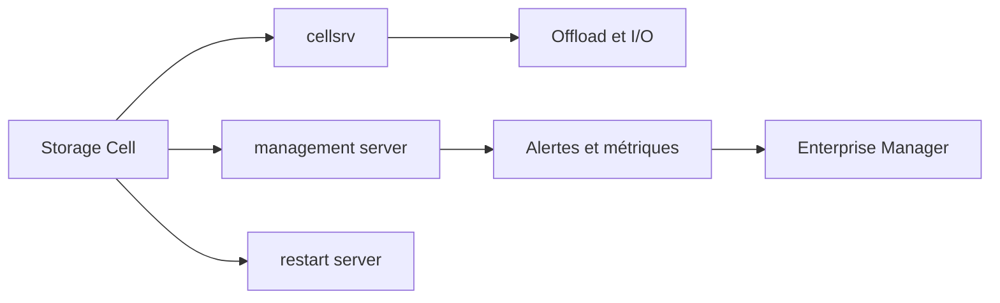

    # Module 15 — Monitoring Exadata System Software

    ## 1. Objectif pédagogique

    Comprendre le suivi des versions, images, alertes logiciel et cohérence Exadata System Software. Le chapitre vise une compréhension opérationnelle et théorique : l’étudiant doit pouvoir expliquer le mécanisme, reconnaître les composants impliqués, lire les principales vues ou commandes et résoudre un cas d’école sans modifier l’environnement.

    ## 2. Pourquoi ce sujet est important

    Le logiciel Exadata est aussi important que le matériel. Des versions incohérentes ou inconnues compliquent support, patching et diagnostic.

    . Une requête SQL peut dépendre du plan d’exécution, du cache flash, de la configuration ASM, de l’état d’une cell et du réseau privé. Ce chapitre montre donc le sujet comme un mécanisme technique, pas comme une simple procédure administrative.

    ## 3. Concepts clés expliqués

    | Concept | Définition claire | Exemple concret |
    |---|---|---|
    | **Exadata System Software** | Logiciel Oracle exécuté sur les storage cells et composants Exadata pour fournir offload, flash, métriques et administration. | Une version cell détermine les fonctionnalités disponibles. |
| **imageinfo** | Commande affichant les informations d’image logicielle installée. | Avant patching, on compare imageinfo sur plusieurs hôtes. |
| **imagehistory** | Historique des images installées et opérations de mise à jour. | Il aide à comprendre depuis quand une version est active. |

    Ces concepts doivent être étudiés ensemble. Par exemple, **Exadata System Software** n’a pas la même signification isolément que dans une architecture RAC, ASM et storage cells. La compréhension vient de la relation entre objet Oracle, ressource Exadata et workload applicatif.

    ## 4. Architecture concernée

    | Composant | Rôle dans ce chapitre |
    |---|---|
    | Database servers | Exécutent les instances, services, agents et outils Oracle liés au module. |
| Storage cells | Apportent stockage intelligent, flash, offload, alertes ou métriques lorsque le sujet touche les I/O. |
| ASM / Grid Infrastructure | Fournissent cluster, diskgroups, ressources RAC et accès aux fichiers Oracle. |
| Réseau RoCE / InfiniBand | Transporte les échanges internes rapides et peut influencer latence et disponibilité. |
| Outils Oracle | Enterprise Manager, AHF, Exachk, TFA, RMAN ou Data Guard selon le thème étudié. |

    Les diagrammes associés au chapitre sont :

    - [`monitoring-stack.mmd`](../diagrams/monitoring-stack.mmd)

    ## 5. Fonctionnement détaillé

    Le logiciel Exadata est aussi important que le matériel. Des versions incohérentes ou inconnues compliquent support, patching et diagnostic.

    . Au niveau **base de données**, Oracle produit un plan d’exécution, gère les sessions, écrit les redo et consulte les vues dynamiques. Au niveau **cluster et stockage**, Grid Infrastructure et ASM rendent disponibles les fichiers de base sur les diskgroups. Au niveau **Exadata**, les storage cells, le cache flash, les métriques et le logiciel système influencent directement le débit, la latence et parfois le volume de données transmis aux DB servers.

    Pour ce module, les notions centrales sont **Exadata System Software, imageinfo, imagehistory**. Elles déterminent la façon dont le composant réagit à une charge réelle. Une bonne lecture technique consiste à comprendre d’abord le chemin suivi par l’opération, puis les conditions qui rendent le mécanisme efficace ou inefficace. Une mauvaise lecture consiste à supposer que la plateforme corrige automatiquement un mauvais modèle de données, une requête mal écrite ou une architecture réseau incomplète.

    ## 6. Exemple concret

    Avant une campagne de patching, l’équipe doit inventorier les images DB nodes et cells.

    Dans ce scénario, l’analyse commence par le symptôme métier, puis remonte vers la couche Oracle concernée. Si le sujet touche les I/O, il faut différencier le temps passé dans Oracle Database, les attentes liées aux cells, la distribution ASM et la santé des storage cells. Si le sujet touche la haute disponibilité, il faut distinguer disponibilité locale RAC, continuité de service, sauvegarde et reprise après sinistre.

    ## 7. Commandes, vues et métriques utiles

    Les commandes ci-dessous sont données comme exemples de lecture. Elles doivent être adaptées aux noms de bases, privilèges, versions et conventions du site.

    ```bash
    crsctl stat res -t
cellcli -e "list alerthistory detail"
tfactl print status
    ```

    | Élément à lire | Interprétation |
    |---|---|
    | Exadata System Software | Cette information indique comment le mécanisme Exadata System Software se comporte dans un cas réel. Elle doit être lue avec le contexte de charge, de version et d’architecture. |
| imageinfo | Cette information indique comment le mécanisme imageinfo se comporte dans un cas réel. Elle doit être lue avec le contexte de charge, de version et d’architecture. |
| imagehistory | Cette information indique comment le mécanisme imagehistory se comporte dans un cas réel. Elle doit être lue avec le contexte de charge, de version et d’architecture. |

    ## 8. Interprétation des résultats

    L’interprétation doit répondre à une question technique précise. Une valeur isolée ne suffit pas : une latence se compare à une période comparable, un volume d’I/O se compare à un plan SQL et un état RAC se compare au placement attendu des services. Les métriques Exadata sont particulièrement utiles lorsqu’elles expliquent pourquoi un volume important de données a été lu, filtré, renvoyé ou retardé.

    Dans les chapitres performance, les valeurs liées aux bytes, événements `cell`, AWR ou ASH indiquent le chemin dominant. Dans les chapitres HA/DR, les états de rôle, lag, services et ressources cluster décrivent la capacité réelle à basculer ou maintenir le service. Dans les chapitres support et maintenance, les rapports AHF, Exachk ou TFA doivent être lus comme des aides structurées, pas comme des remplacements de raisonnement.

    ## 9. Erreurs fréquentes

    | Erreur | Cause probable | Correction pédagogique |
    |---|---|---|
    | Confondre symptôme et cause | Le premier message visible vient parfois d’une couche différente de la cause réelle. | Reconstituer le chemin technique avant de conclure. |
    | Appliquer une recette générique | Exadata dépend fortement du workload, du plan SQL, de la version et du modèle de service. | Relire les composants du chapitre et adapter le diagnostic. |
    | Ignorer les dépendances | Une base RAC dépend de GI, ASM, réseau privé et storage cells. | Vérifier les dépendances avant toute hypothèse. |
    | Oublier les limites du mécanisme | Certaines fonctions Exadata ne s’appliquent pas à tous les accès ou toutes les charges. | Identifier les conditions d’éligibilité et les cas d’exclusion. |

    ## 10. Bonnes pratiques

    | Bonne pratique | Application concrète |
    |---|---|
    | Partir du mécanisme | Dessiner le chemin DB → ASM → cell → réseau → retour résultat selon le sujet. |
    | Séparer lecture et changement | Les commandes de lecture servent à comprendre ; les changements exigent runbook et validation. |
    | Comparer avec un état de référence | Une valeur a du sens lorsqu’elle est rapprochée d’une période saine ou d’une cible prévue. |
    | Documenter la version | Les fonctionnalités et commandes peuvent varier selon génération Exadata et version Oracle. |

    ## 11. Exercice pratique

    Vous êtes responsable du sujet **Monitoring Exadata System Software** sur une plateforme Exadata de formation. À partir du scénario suivant, rédigez une analyse de deux pages :

    > Avant une campagne de patching, l’équipe doit inventorier les images DB nodes et cells.

    Votre réponse doit inclure un schéma simple des composants impliqués, trois commandes ou vues à exécuter, deux métriques à lire, les erreurs à éviter et une recommandation finale.

    ## 12. Corrigé de l’exercice

    Une bonne réponse commence par identifier les composants du chapitre : **Exadata System Software, imageinfo, imagehistory**. Elle explique ensuite le chemin technique suivi par l’opération et indique pourquoi les commandes proposées permettent de vérifier ce chemin. Les commandes attendues sont celles de la section 7, adaptées aux noms réels de l’environnement.

    Le corrigé doit aussi distinguer les observations et les décisions. Par exemple, constater un lag, une alerte cell, un volume `eligible bytes` ou une ressource CRS offline ne suffit pas : il faut expliquer la conséquence sur l’application, la disponibilité ou la performance.  : optimisation SQL, ajustement de plan de ressources, revue réseau, ouverture SR, test de restore ou préparation CAB selon le module.

    ## 13. Synthèse à retenir

    ```text
    À retenir
    - Monitoring Exadata System Software  : base, cluster, ASM, storage cells, réseau et outils Oracle.
    - Les notions centrales du chapitre sont : Exadata System Software, imageinfo, imagehistory.
    - Les commandes de lecture permettent de comprendre le mécanisme avant toute action de changement.
    - Les erreurs les plus coûteuses viennent d’une lecture isolée d’une seule couche.
    - Un bon administrateur Exadata relie toujours architecture, workload, métriques et impact métier.
    ```


## Références officielles

| Référence | Utilisation dans le module |
|---|---|
| [Oracle University — Exadata Database Machine Administration Workshop](https://education.oracle.com/exadata-database-machine-administration-workshop/courP_4599) | Cadre pédagogique général du workshop. |
| [Oracle Exadata Documentation](https://docs.oracle.com/en/engineered-systems/exadata-database-machine/) | Administration Exadata, Storage Server, CellCLI, maintenance et monitoring. |
| [Oracle Database Documentation](https://docs.oracle.com/en/database/) | Vues dynamiques, SQL, RMAN, Data Guard, AWR/ASH selon licences. |
| [Oracle Maximum Availability Architecture](https://www.oracle.com/database/technologies/high-availability/maa.html) | Principes HA/DR, Data Guard, sauvegarde et continuité de service. |
| [Oracle Autonomous Health Framework](https://docs.oracle.com/en/engineered-systems/health-diagnostics/autonomous-health-framework/) | AHF, Exachk, ORAchk, TFA et diagnostics automatisés. |
## Complément expert V5 — Exadata System Software et services cellule

### Explication technique spécifique

Le monitoring Exadata ne consiste pas à regarder une seule alerte ou un seul graphe. Pour **Exadata System Software**, l’objectif est de rapprocher l’état matériel, l’état logiciel, les métriques courantes et la perception côté base. Une alerte cellule peut être bénigne si elle correspond à une transition attendue, mais elle peut aussi expliquer une hausse de latence observée par les sessions Oracle. La démarche experte consiste à identifier la mesure native, son objet, son horodatage, puis à la comparer avec les waits, les statistiques SQL et l’état ASM. Enterprise Manager apporte une vision centralisée, tandis que `cellcli`, les vues dynamiques et les journaux de diagnostic donnent une preuve locale.[^v5-monitoring]

Pour ce thème, un DBA confirmé doit distinguer **symptôme**, **cause probable** et **preuve observable**. Le symptôme typique est : des alertes répétées sur une cellule et une baisse d’efficacité Smart Scan. La cause peut être locale au composant, liée à une saturation, à une opération planifiée ou à une panne partielle. La preuve doit venir d’au moins deux sources indépendantes : métrique cellule et vue base, alerte système et historique Enterprise Manager, ou état ASM et journal Exadata.

| Indicateur | Ce qu’il mesure | Interprétation experte |
|---|---|---|
| `CL_CPUT` | CPU consommé sur la cellule | Peut indiquer offload, compression ou tâches internes |
| `CL_MEMUT` | Utilisation mémoire cellule | À corréler avec services cellule et alertes |
| `IORM_MODE` | Mode ou état lié à IORM selon version | Confirme la présence de gouvernance I/O |



### Exemple concret réaliste

Pendant une fenêtre de reporting, l’équipe observe des alertes répétées sur une cellule et une baisse d’efficacité Smart Scan. Le réflexe débutant serait de conclure à un problème général de performance. L’analyse V5 impose plutôt de vérifier si l’événement est isolé à une cellule, à un database server, à un réseau ou à une base. Si une seule cellule montre une métrique anormale alors que les autres restent stables, la piste est locale. Si toutes les cellules montrent la même hausse au même instant, il faut chercher une opération globale : chargement massif, backup, rebalance ASM, scan parallèle ou patching.

### Comment raisonner

Commence par fixer la période exacte de l’incident, puis compare trois horloges : heure applicative, heure base et heure composant Exadata. Ensuite, identifie l’objet affecté : cellule, disque, flash, port réseau, instance, service, diskgroup ou target Enterprise Manager. Enfin, vérifie si l’anomalie modifie réellement l’expérience des sessions : hausse des waits, baisse de débit, erreurs applicatives ou alertes critiques. Une métrique élevée sans impact observable peut rester un signal de capacité ; une métrique modérée mais corrélée à des erreurs peut être prioritaire.

### Commandes / vues utiles

```bash
cellcli -e "list cell attributes name,releaseVersion,kernelVersion,makeModel,status"
cellcli -e "list metriccurrent where objectType = 'CELL' attributes name,metricValue"
cellcli -e "list alerthistory attributes severity,alertMessage,beginTime"
```

```sql
select inst_id, event, total_waits, time_waited_micro
from gv$system_event
where event like 'cell%' or event like 'gc%' or event like 'log file%'
order by time_waited_micro desc fetch first 20 rows only;

select inst_id, name, value
from gv$sysstat
where name like 'cell%' or name like 'physical%'
order by inst_id, name;
```

### Comment interpréter

L’interprétation correcte cherche une corrélation, pas une coïncidence. Si la métrique change avant le symptôme applicatif, elle peut être causale. Si elle change après, elle peut être une conséquence. Si elle ne change que sur un composant, la portée est locale. Si elle change partout, la cause est probablement un workload ou une opération de plate-forme. Une cellule peut répondre au ping tout en ayant un service Exadata dégradé ; l’état réseau seul n’est pas suffisant.

### Exercice pratique

Une cellule affiche une version logicielle différente des autres après maintenance. Explique le risque pédagogique et les preuves à collecter.

### Corrigé détaillé

Il faut vérifier la version avec `list cell attributes releaseVersion`, comparer toutes les cellules, lire les alertes et vérifier les symptômes côté base. Une différence de version après maintenance peut être temporaire ou révéler un patch incomplet. La réponse correcte ne demande pas de corriger directement ; elle documente l’écart et prépare l’escalade.

### Limites et pièges

Le principal piège est de diagnostiquer depuis une capture unique. Exadata est fortement parallèle : un instantané peut masquer un pic court, un effet de cache ou une opération transitoire. Il faut conserver l’horodatage, comparer plusieurs composants et éviter les actions correctives sans preuve. Les commandes proposées ici restent read-only et servent à documenter l’état, pas à modifier la plate-forme.

### À retenir

Pour Exadata System Software, le monitoring expert relie métriques Exadata, vues Oracle, alertes et chronologie. La valeur pédagogique vient de l’interprétation, pas de l’accumulation de sorties brutes.

[^v5-monitoring]: Oracle, *Monitoring Oracle Exadata Database Machine*, https://docs.oracle.com/en/engineered-systems/exadata-database-machine/dbmmn/
