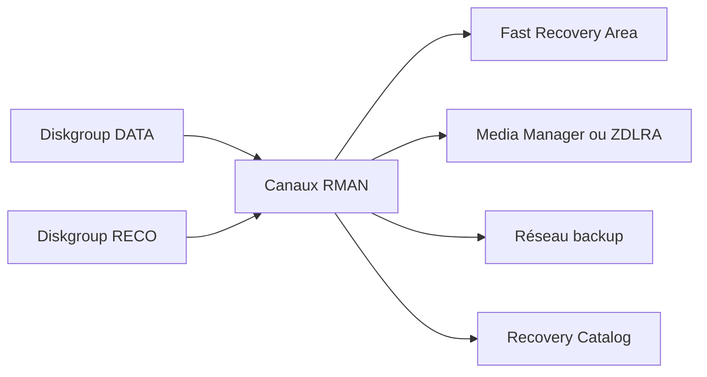

    # Module 22 — Backup and Recovery

    ## 1. Objectif pédagogique

    Étudier RMAN, FRA, archivelogs, controlfile autobackup, restore validation et relation avec Data Guard. Le chapitre vise une compréhension opérationnelle et théorique : l’étudiant doit pouvoir expliquer le mécanisme, reconnaître les composants impliqués, lire les principales vues ou commandes et résoudre un cas d’école sans modifier l’environnement.

    ## 2. Pourquoi ce sujet est important

    Une sauvegarde n’a de valeur que si la récupération est possible dans les délais. Exadata peut accélérer certaines opérations, mais RMAN, archivelogs et tests restent indispensables.

    . Une requête SQL peut dépendre du plan d’exécution, du cache flash, de la configuration ASM, de l’état d’une cell et du réseau privé. Ce chapitre montre donc le sujet comme un mécanisme technique, pas comme une simple procédure administrative.

    ## 3. Concepts clés expliqués

    | Concept | Définition claire | Exemple concret |
    |---|---|---|
    | **RMAN** | Outil Oracle de sauvegarde, restauration et récupération physique des bases. | RMAN liste les backups et restaure une base après perte fichier. |
| **FRA** | Fast Recovery Area stockant archivelogs, backups, flashback logs selon configuration. | Une FRA saturée peut bloquer la génération d’archivelogs. |
| **Restore validation** | Test vérifiant qu’une sauvegarde est lisible et utilisable sans restaurer complètement en production. | Un restore validate détecte un backup corrompu avant incident réel. |

    Ces concepts doivent être étudiés ensemble. Par exemple, **RMAN** n’a pas la même signification isolément que dans une architecture RAC, ASM et storage cells. La compréhension vient de la relation entre objet Oracle, ressource Exadata et workload applicatif.

    ## 4. Architecture concernée

    | Composant | Rôle dans ce chapitre |
    |---|---|
    | Database servers | Exécutent les instances, services, agents et outils Oracle liés au module. |
| Storage cells | Apportent stockage intelligent, flash, offload, alertes ou métriques lorsque le sujet touche les I/O. |
| ASM / Grid Infrastructure | Fournissent cluster, diskgroups, ressources RAC et accès aux fichiers Oracle. |
| Réseau RoCE / InfiniBand | Transporte les échanges internes rapides et peut influencer latence et disponibilité. |
| Outils Oracle | Enterprise Manager, AHF, Exachk, TFA, RMAN ou Data Guard selon le thème étudié. |

    Les diagrammes associés au chapitre sont :

    - [`backup-recovery-dataguard.mmd`](../diagrams/backup-recovery-dataguard.mmd)

    ## 5. Fonctionnement détaillé

    Une sauvegarde n’a de valeur que si la récupération est possible dans les délais. Exadata peut accélérer certaines opérations, mais RMAN, archivelogs et tests restent indispensables.

    . Au niveau **base de données**, Oracle produit un plan d’exécution, gère les sessions, écrit les redo et consulte les vues dynamiques. Au niveau **cluster et stockage**, Grid Infrastructure et ASM rendent disponibles les fichiers de base sur les diskgroups. Au niveau **Exadata**, les storage cells, le cache flash, les métriques et le logiciel système influencent directement le débit, la latence et parfois le volume de données transmis aux DB servers.

    Pour ce module, les notions centrales sont **RMAN, FRA, Restore validation**. Elles déterminent la façon dont le composant réagit à une charge réelle. Une bonne lecture technique consiste à comprendre d’abord le chemin suivi par l’opération, puis les conditions qui rendent le mécanisme efficace ou inefficace. Une mauvaise lecture consiste à supposer que la plateforme corrige automatiquement un mauvais modèle de données, une requête mal écrite ou une architecture réseau incomplète.

    ## 6. Exemple concret

    Avant patching majeur, le responsable exige une démonstration de récupérabilité.

    Dans ce scénario, l’analyse commence par le symptôme métier, puis remonte vers la couche Oracle concernée. Si le sujet touche les I/O, il faut différencier le temps passé dans Oracle Database, les attentes liées aux cells, la distribution ASM et la santé des storage cells. Si le sujet touche la haute disponibilité, il faut distinguer disponibilité locale RAC, continuité de service, sauvegarde et reprise après sinistre.

    ## 7. Commandes, vues et métriques utiles

    Les commandes ci-dessous sont données comme exemples de lecture. Elles doivent être adaptées aux noms de bases, privilèges, versions et conventions du site.

    ```bash
    rman target / <<EOF
show all;
list backup summary;
report schema;
EOF
select log_mode,force_logging,database_role from v$database;
select * from v$recovery_file_dest;
    ```

    | Élément à lire | Interprétation |
    |---|---|
    | RMAN | Cette information indique comment le mécanisme RMAN se comporte dans un cas réel. Elle doit être lue avec le contexte de charge, de version et d’architecture. |
| FRA | Cette information indique comment le mécanisme FRA se comporte dans un cas réel. Elle doit être lue avec le contexte de charge, de version et d’architecture. |
| Restore validation | Cette information indique comment le mécanisme Restore validation se comporte dans un cas réel. Elle doit être lue avec le contexte de charge, de version et d’architecture. |

    ## 8. Interprétation des résultats

    L’interprétation doit répondre à une question technique précise. Une valeur isolée ne suffit pas : une latence se compare à une période comparable, un volume d’I/O se compare à un plan SQL et un état RAC se compare au placement attendu des services. Les métriques Exadata sont particulièrement utiles lorsqu’elles expliquent pourquoi un volume important de données a été lu, filtré, renvoyé ou retardé.

    Dans les chapitres performance, les valeurs liées aux bytes, événements `cell`, AWR ou ASH indiquent le chemin dominant. Dans les chapitres HA/DR, les états de rôle, lag, services et ressources cluster décrivent la capacité réelle à basculer ou maintenir le service. Dans les chapitres support et maintenance, les rapports AHF, Exachk ou TFA doivent être lus comme des aides structurées, pas comme des remplacements de raisonnement.

    ## 9. Erreurs fréquentes

    | Erreur | Cause probable | Correction pédagogique |
    |---|---|---|
    | Confondre symptôme et cause | Le premier message visible vient parfois d’une couche différente de la cause réelle. | Reconstituer le chemin technique avant de conclure. |
    | Appliquer une recette générique | Exadata dépend fortement du workload, du plan SQL, de la version et du modèle de service. | Relire les composants du chapitre et adapter le diagnostic. |
    | Ignorer les dépendances | Une base RAC dépend de GI, ASM, réseau privé et storage cells. | Vérifier les dépendances avant toute hypothèse. |
    | Oublier les limites du mécanisme | Certaines fonctions Exadata ne s’appliquent pas à tous les accès ou toutes les charges. | Identifier les conditions d’éligibilité et les cas d’exclusion. |

    ## 10. Bonnes pratiques

    | Bonne pratique | Application concrète |
    |---|---|
    | Partir du mécanisme | Dessiner le chemin DB → ASM → cell → réseau → retour résultat selon le sujet. |
    | Séparer lecture et changement | Les commandes de lecture servent à comprendre ; les changements exigent runbook et validation. |
    | Comparer avec un état de référence | Une valeur a du sens lorsqu’elle est rapprochée d’une période saine ou d’une cible prévue. |
    | Documenter la version | Les fonctionnalités et commandes peuvent varier selon génération Exadata et version Oracle. |

    ## 11. Exercice pratique

    Vous êtes responsable du sujet **Backup and Recovery** sur une plateforme Exadata de formation. À partir du scénario suivant, rédigez une analyse de deux pages :

    > Avant patching majeur, le responsable exige une démonstration de récupérabilité.

    Votre réponse doit inclure un schéma simple des composants impliqués, trois commandes ou vues à exécuter, deux métriques à lire, les erreurs à éviter et une recommandation finale.

    ## 12. Corrigé de l’exercice

    Une bonne réponse commence par identifier les composants du chapitre : **RMAN, FRA, Restore validation**. Elle explique ensuite le chemin technique suivi par l’opération et indique pourquoi les commandes proposées permettent de vérifier ce chemin. Les commandes attendues sont celles de la section 7, adaptées aux noms réels de l’environnement.

    Le corrigé doit aussi distinguer les observations et les décisions. Par exemple, constater un lag, une alerte cell, un volume `eligible bytes` ou une ressource CRS offline ne suffit pas : il faut expliquer la conséquence sur l’application, la disponibilité ou la performance.  : optimisation SQL, ajustement de plan de ressources, revue réseau, ouverture SR, test de restore ou préparation CAB selon le module.

    ## 13. Synthèse à retenir

    ```text
    À retenir
    - Backup and Recovery  : base, cluster, ASM, storage cells, réseau et outils Oracle.
    - Les notions centrales du chapitre sont : RMAN, FRA, Restore validation.
    - Les commandes de lecture permettent de comprendre le mécanisme avant toute action de changement.
    - Les erreurs les plus coûteuses viennent d’une lecture isolée d’une seule couche.
    - Un bon administrateur Exadata relie toujours architecture, workload, métriques et impact métier.
    ```


## Références officielles

| Référence | Utilisation dans le module |
|---|---|
| [Oracle University — Exadata Database Machine Administration Workshop](https://education.oracle.com/exadata-database-machine-administration-workshop/courP_4599) | Cadre pédagogique général du workshop. |
| [Oracle Exadata Documentation](https://docs.oracle.com/en/engineered-systems/exadata-database-machine/) | Administration Exadata, Storage Server, CellCLI, maintenance et monitoring. |
| [Oracle Database Documentation](https://docs.oracle.com/en/database/) | Vues dynamiques, SQL, RMAN, Data Guard, AWR/ASH selon licences. |
| [Oracle Maximum Availability Architecture](https://www.oracle.com/database/technologies/high-availability/maa.html) | Principes HA/DR, Data Guard, sauvegarde et continuité de service. |
| [Oracle Autonomous Health Framework](https://docs.oracle.com/en/engineered-systems/health-diagnostics/autonomous-health-framework/) | AHF, Exachk, ORAchk, TFA et diagnostics automatisés. |
## Complément expert V5 — Backup, recovery et Exadata

### Explication technique spécifique

Sur Exadata, RMAN lit les datafiles via ASM et peut écrire vers RECO, une librairie média, un ZDLRA, un stockage NFS ou un réseau de backup. La performance dépend de la bande passante cellule, du parallélisme RMAN, du débit cible, du redo généré, de la capacité RECO et de la concurrence avec les workloads SQL. Le design expert sépare sauvegarde locale rapide, copie externe, rétention, validation et scénario de restauration. Une sauvegarde réussie mais impossible à restaurer dans le RTO attendu n’est pas un design HA/DR satisfaisant.[^v5-rman]



### Exemple concret réaliste

Une base de 40 To est sauvegardée chaque nuit. Le backup commence vite puis ralentit lorsque RECO approche d’un seuil élevé et que l’archivage s’accumule. Le problème n’est pas forcément la lecture depuis DATA ; il peut venir du débit de destination, d’un nombre de canaux mal dimensionné, d’une compression coûteuse CPU ou d’une saturation réseau backup.

### Comment raisonner

Analyse RMAN par flux : source ASM, canaux, CPU, réseau, cible et catalogue. Vérifie aussi l’objectif de restauration : restaurer sur la même machine, sur un site DR, vers une appliance de récupération ou vers un environnement de test. Le nombre de canaux doit être cohérent avec la cible ; trop de canaux peut dégrader la production.

### Commandes / vues utiles

```sql
select * from v$rman_backup_job_details order by start_time desc fetch first 10 rows only;
select name, space_limit/1024/1024 mb_limit, space_used/1024/1024 mb_used from v$recovery_file_dest;
select sequence#, applied, archived, completion_time from v$archived_log order by sequence# desc fetch first 20 rows only;
```

```bash
asmcmd lsdg
cellcli -e "list metriccurrent where name like 'CD_IO%' attributes name,metricValue,objectName"
```

### Comment interpréter

Un backup lent peut être source-bound ou target-bound. Si les cellules lisent vite mais la cible écrit lentement, le réseau ou média manager est suspect. Si les waits RMAN montrent lecture lente et que les cellules sont chargées, la concurrence I/O est à étudier. Si RECO est sous pression, le risque immédiat peut être l’archivage et la capacité de récupération.

### Exercice pratique

Un backup RMAN dépasse sa fenêtre de nuit depuis trois jours. Donne un diagnostic read-only et une conclusion argumentée.

### Corrigé détaillé

Il faut lire `v$rman_backup_job_details`, vérifier la FRA avec `v$recovery_file_dest`, contrôler les archivelogs, ASM `lsdg`, métriques cellule et réseau backup. Si la durée augmente avec le volume d’archivelogs, la cause peut être fonctionnelle. Si le débit chute sans hausse de volume, la cible ou le réseau est suspect. La conclusion doit citer la preuve temporelle et la couche limitante.

### Limites et pièges

Ne pas confondre sauvegarde et restaurabilité. Ne pas activer compression ou chiffrement sans mesurer CPU. Ne pas utiliser RECO comme espace illimité. Un test de restore reste la preuve ultime.

### À retenir

Le backup Exadata est un pipeline. Le diagnostic expert identifie le maillon lent et vérifie que le RTO/RPO reste atteignable.

[^v5-rman]: Oracle, *Oracle Database Backup and Recovery User's Guide*, https://docs.oracle.com/en/database/oracle/oracle-database/19/bradv/
