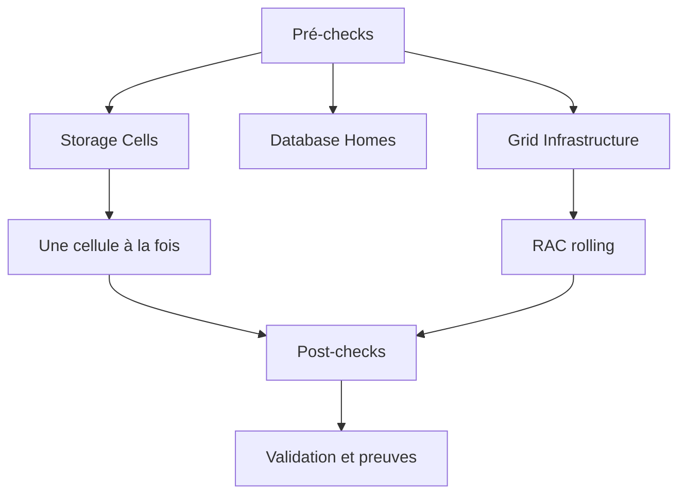

    # Module 25 — Patching

    ## 1. Objectif pédagogique

    Comprendre le patching Exadata : couches, rolling, pré-check, post-check, rollback et responsabilités. Le chapitre vise une compréhension opérationnelle et théorique : l’étudiant doit pouvoir expliquer le mécanisme, reconnaître les composants impliqués, lire les principales vues ou commandes et résoudre un cas d’école sans modifier l’environnement.

    ## 2. Pourquoi ce sujet est important

    Le patching Exadata couvre plusieurs couches. Un bon chapitre enseigne la logique de séquence et de risque sans fournir de commande destructrice hors procédure officielle.

    . Une requête SQL peut dépendre du plan d’exécution, du cache flash, de la configuration ASM, de l’état d’une cell et du réseau privé. Ce chapitre montre donc le sujet comme un mécanisme technique, pas comme une simple procédure administrative.

    ## 3. Concepts clés expliqués

    | Concept | Définition claire | Exemple concret |
    |---|---|---|
    | **Rolling patch** | Mise à jour progressive limitant l’indisponibilité en traitant les composants un par un lorsque supporté. | Un patch GI rolling garde certains services disponibles. |
| **Pre-check** | Contrôle avant patch : santé cluster, backup, Data Guard, versions et compatibilité. | Un exachk pré-patch révèle un risque à corriger avant Go. |
| **Rollback** | Plan de retour arrière prévu si le patch échoue ou dégrade le service. | La stratégie diffère entre patch DB, GI, OS et image Exadata. |

    Ces concepts doivent être étudiés ensemble. Par exemple, **Rolling patch** n’a pas la même signification isolément que dans une architecture RAC, ASM et storage cells. La compréhension vient de la relation entre objet Oracle, ressource Exadata et workload applicatif.

    ## 4. Architecture concernée

    | Composant | Rôle dans ce chapitre |
    |---|---|
    | Database servers | Exécutent les instances, services, agents et outils Oracle liés au module. |
| Storage cells | Apportent stockage intelligent, flash, offload, alertes ou métriques lorsque le sujet touche les I/O. |
| ASM / Grid Infrastructure | Fournissent cluster, diskgroups, ressources RAC et accès aux fichiers Oracle. |
| Réseau RoCE / InfiniBand | Transporte les échanges internes rapides et peut influencer latence et disponibilité. |
| Outils Oracle | Enterprise Manager, AHF, Exachk, TFA, RMAN ou Data Guard selon le thème étudié. |

    Les diagrammes associés au chapitre sont :

    - [`patching-process.mmd`](../diagrams/patching-process.mmd)

    ## 5. Fonctionnement détaillé

    Le patching Exadata couvre plusieurs couches. Un bon chapitre enseigne la logique de séquence et de risque sans fournir de commande destructrice hors procédure officielle.

    . Au niveau **base de données**, Oracle produit un plan d’exécution, gère les sessions, écrit les redo et consulte les vues dynamiques. Au niveau **cluster et stockage**, Grid Infrastructure et ASM rendent disponibles les fichiers de base sur les diskgroups. Au niveau **Exadata**, les storage cells, le cache flash, les métriques et le logiciel système influencent directement le débit, la latence et parfois le volume de données transmis aux DB servers.

    Pour ce module, les notions centrales sont **Rolling patch, Pre-check, Rollback**. Elles déterminent la façon dont le composant réagit à une charge réelle. Une bonne lecture technique consiste à comprendre d’abord le chemin suivi par l’opération, puis les conditions qui rendent le mécanisme efficace ou inefficace. Une mauvaise lecture consiste à supposer que la plateforme corrige automatiquement un mauvais modèle de données, une requête mal écrite ou une architecture réseau incomplète.

    ## 6. Exemple concret

    Une campagne patch trimestrielle doit être préparée pour réduire le risque sur une base critique.

    Dans ce scénario, l’analyse commence par le symptôme métier, puis remonte vers la couche Oracle concernée. Si le sujet touche les I/O, il faut différencier le temps passé dans Oracle Database, les attentes liées aux cells, la distribution ASM et la santé des storage cells. Si le sujet touche la haute disponibilité, il faut distinguer disponibilité locale RAC, continuité de service, sauvegarde et reprise après sinistre.

    ## 7. Commandes, vues et métriques utiles

    Les commandes ci-dessous sont données comme exemples de lecture. Elles doivent être adaptées aux noms de bases, privilèges, versions et conventions du site.

    ```bash
    imageinfo
imagehistory
opatch lsinventory
crsctl stat res -t
exachk
    ```

    | Élément à lire | Interprétation |
    |---|---|
    | Rolling patch | Cette information indique comment le mécanisme Rolling patch se comporte dans un cas réel. Elle doit être lue avec le contexte de charge, de version et d’architecture. |
| Pre-check | Cette information indique comment le mécanisme Pre-check se comporte dans un cas réel. Elle doit être lue avec le contexte de charge, de version et d’architecture. |
| Rollback | Cette information indique comment le mécanisme Rollback se comporte dans un cas réel. Elle doit être lue avec le contexte de charge, de version et d’architecture. |

    ## 8. Interprétation des résultats

    L’interprétation doit répondre à une question technique précise. Une valeur isolée ne suffit pas : une latence se compare à une période comparable, un volume d’I/O se compare à un plan SQL et un état RAC se compare au placement attendu des services. Les métriques Exadata sont particulièrement utiles lorsqu’elles expliquent pourquoi un volume important de données a été lu, filtré, renvoyé ou retardé.

    Dans les chapitres performance, les valeurs liées aux bytes, événements `cell`, AWR ou ASH indiquent le chemin dominant. Dans les chapitres HA/DR, les états de rôle, lag, services et ressources cluster décrivent la capacité réelle à basculer ou maintenir le service. Dans les chapitres support et maintenance, les rapports AHF, Exachk ou TFA doivent être lus comme des aides structurées, pas comme des remplacements de raisonnement.

    ## 9. Erreurs fréquentes

    | Erreur | Cause probable | Correction pédagogique |
    |---|---|---|
    | Confondre symptôme et cause | Le premier message visible vient parfois d’une couche différente de la cause réelle. | Reconstituer le chemin technique avant de conclure. |
    | Appliquer une recette générique | Exadata dépend fortement du workload, du plan SQL, de la version et du modèle de service. | Relire les composants du chapitre et adapter le diagnostic. |
    | Ignorer les dépendances | Une base RAC dépend de GI, ASM, réseau privé et storage cells. | Vérifier les dépendances avant toute hypothèse. |
    | Oublier les limites du mécanisme | Certaines fonctions Exadata ne s’appliquent pas à tous les accès ou toutes les charges. | Identifier les conditions d’éligibilité et les cas d’exclusion. |

    ## 10. Bonnes pratiques

    | Bonne pratique | Application concrète |
    |---|---|
    | Partir du mécanisme | Dessiner le chemin DB → ASM → cell → réseau → retour résultat selon le sujet. |
    | Séparer lecture et changement | Les commandes de lecture servent à comprendre ; les changements exigent runbook et validation. |
    | Comparer avec un état de référence | Une valeur a du sens lorsqu’elle est rapprochée d’une période saine ou d’une cible prévue. |
    | Documenter la version | Les fonctionnalités et commandes peuvent varier selon génération Exadata et version Oracle. |

    ## 11. Exercice pratique

    Vous êtes responsable du sujet **Patching** sur une plateforme Exadata de formation. À partir du scénario suivant, rédigez une analyse de deux pages :

    > Une campagne patch trimestrielle doit être préparée pour réduire le risque sur une base critique.

    Votre réponse doit inclure un schéma simple des composants impliqués, trois commandes ou vues à exécuter, deux métriques à lire, les erreurs à éviter et une recommandation finale.

    ## 12. Corrigé de l’exercice

    Une bonne réponse commence par identifier les composants du chapitre : **Rolling patch, Pre-check, Rollback**. Elle explique ensuite le chemin technique suivi par l’opération et indique pourquoi les commandes proposées permettent de vérifier ce chemin. Les commandes attendues sont celles de la section 7, adaptées aux noms réels de l’environnement.

    Le corrigé doit aussi distinguer les observations et les décisions. Par exemple, constater un lag, une alerte cell, un volume `eligible bytes` ou une ressource CRS offline ne suffit pas : il faut expliquer la conséquence sur l’application, la disponibilité ou la performance.  : optimisation SQL, ajustement de plan de ressources, revue réseau, ouverture SR, test de restore ou préparation CAB selon le module.

    ## 13. Synthèse à retenir

    ```text
    À retenir
    - Patching  : base, cluster, ASM, storage cells, réseau et outils Oracle.
    - Les notions centrales du chapitre sont : Rolling patch, Pre-check, Rollback.
    - Les commandes de lecture permettent de comprendre le mécanisme avant toute action de changement.
    - Les erreurs les plus coûteuses viennent d’une lecture isolée d’une seule couche.
    - Un bon administrateur Exadata relie toujours architecture, workload, métriques et impact métier.
    ```


## Références officielles

| Référence | Utilisation dans le module |
|---|---|
| [Oracle University — Exadata Database Machine Administration Workshop](https://education.oracle.com/exadata-database-machine-administration-workshop/courP_4599) | Cadre pédagogique général du workshop. |
| [Oracle Exadata Documentation](https://docs.oracle.com/en/engineered-systems/exadata-database-machine/) | Administration Exadata, Storage Server, CellCLI, maintenance et monitoring. |
| [Oracle Database Documentation](https://docs.oracle.com/en/database/) | Vues dynamiques, SQL, RMAN, Data Guard, AWR/ASH selon licences. |
| [Oracle Maximum Availability Architecture](https://www.oracle.com/database/technologies/high-availability/maa.html) | Principes HA/DR, Data Guard, sauvegarde et continuité de service. |
| [Oracle Autonomous Health Framework](https://docs.oracle.com/en/engineered-systems/health-diagnostics/autonomous-health-framework/) | AHF, Exachk, ORAchk, TFA et diagnostics automatisés. |
## Complément expert V5 — Patching Exadata sans perte de contrôle

### Explication technique spécifique

Le patching Exadata concerne plusieurs couches : database home, Grid Infrastructure, Exadata System Software des cellules, firmware, OS des database servers, switches et agents. Le risque principal n’est pas seulement l’échec d’un patch ; c’est l’incohérence temporaire entre couches ou l’absence de plan de retour. Un patch rolling peut maintenir le service, mais seulement si RAC, services, redondance ASM, capacité restante et procédures sont vérifiés.[^v5-patching]



### Exemple concret réaliste

Avant de patcher une cellule, on vérifie que les diskgroups peuvent tolérer l’indisponibilité temporaire de ses grid disks. Pendant l’intervention, ASM peut resynchroniser après retour. Si une autre cellule est déjà dégradée, continuer le patch peut transformer une maintenance en incident. La fenêtre de patching doit donc intégrer l’état réel, pas seulement le calendrier.

### Comment raisonner

Le raisonnement patching part des prérequis : backups, état RAC, état ASM, absence de panne matérielle, versions actuelles, compatibilité et plan de rollback. Ensuite on ordonne les couches selon la procédure Oracle. Enfin on valide : versions, alertes, services, instances, diskgroups et performance de base.

### Commandes / vues utiles

```bash
opatch lsinventory
crsctl stat res -t
srvctl status database -d <DB_UNIQUE_NAME>
asmcmd lsdg
cellcli -e "list cell attributes name,releaseVersion,status"
cellcli -e "list alerthistory attributes severity,alertMessage,beginTime"
```

### Comment interpréter

Une commande de version réussie n’est pas une validation complète. Il faut vérifier l’état fonctionnel des services, l’absence d’alertes critiques, la capacité ASM et les symptômes post-maintenance. Une différence de version peut être attendue pendant rolling patch, mais elle doit être temporaire et documentée.

### Exercice pratique

Pourquoi faut-il vérifier ASM avant de patcher une storage cell ?

### Corrigé détaillé

Parce que le patch rendra potentiellement indisponibles des grid disks de cette cellule. ASM doit disposer de redondance et de capacité suffisantes pour maintenir les fichiers accessibles. Si un autre failure group est déjà dégradé, le patch augmente le risque. La réponse correcte relie patch cellule, grid disks, failure groups et disponibilité des fichiers.

### Limites et pièges

Ne pas patcher pour “tester” en production. Ne pas ignorer les alertes hardware avant maintenance. Ne pas confondre rolling avec sans impact : les performances peuvent baisser pendant la fenêtre.

### À retenir

Le patching Exadata est une opération de cohérence multi-couches. Les preuves avant et après patch comptent autant que la commande de patch elle-même.

[^v5-patching]: Oracle, *Oracle Exadata Database Machine Maintenance Guide*, https://docs.oracle.com/en/engineered-systems/exadata-database-machine/dbmmn/
