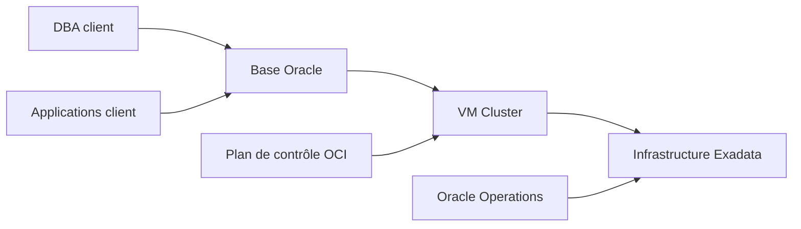

    # Module 27 — Exadata Cloud Service et Cloud@Customer

    ## 1. Objectif pédagogique

    Comparer Exadata on-prem, Exadata Database Service et Exadata Cloud@Customer : responsabilités, IAM, réseau et opérations. Le chapitre vise une compréhension opérationnelle et théorique : l’étudiant doit pouvoir expliquer le mécanisme, reconnaître les composants impliqués, lire les principales vues ou commandes et résoudre un cas d’école sans modifier l’environnement.

    ## 2. Pourquoi ce sujet est important

    Les modèles cloud changent les droits, outils et responsabilités. Le savoir-faire Exadata reste utile, mais l’exploitation passe aussi par OCI, IAM, compartiments et fenêtres de maintenance cloud.

    . Une requête SQL peut dépendre du plan d’exécution, du cache flash, de la configuration ASM, de l’état d’une cell et du réseau privé. Ce chapitre montre donc le sujet comme un mécanisme technique, pas comme une simple procédure administrative.

    ## 3. Concepts clés expliqués

    | Concept | Définition claire | Exemple concret |
    |---|---|---|
    | **Responsabilité partagée** | Répartition des tâches entre Oracle et client selon service cloud. | Oracle peut gérer infrastructure tandis que le client gère schémas, accès et certaines opérations DB. |
| **VM Cluster** | Ressource OCI représentant un cluster de machines virtuelles Exadata Database Service. | Les bases cloud s’exécutent dans un VM cluster rattaché à une infrastructure Exadata. |
| **IAM OCI** | Gestion des identités, groupes, politiques et permissions dans Oracle Cloud Infrastructure. | Une politique IAM insuffisante empêche un DBA cloud de voir un cluster. |

    Ces concepts doivent être étudiés ensemble. Par exemple, **Responsabilité partagée** n’a pas la même signification isolément que dans une architecture RAC, ASM et storage cells. La compréhension vient de la relation entre objet Oracle, ressource Exadata et workload applicatif.

    ## 4. Architecture concernée

    | Composant | Rôle dans ce chapitre |
    |---|---|
    | Database servers | Exécutent les instances, services, agents et outils Oracle liés au module. |
| Storage cells | Apportent stockage intelligent, flash, offload, alertes ou métriques lorsque le sujet touche les I/O. |
| ASM / Grid Infrastructure | Fournissent cluster, diskgroups, ressources RAC et accès aux fichiers Oracle. |
| Réseau RoCE / InfiniBand | Transporte les échanges internes rapides et peut influencer latence et disponibilité. |
| Outils Oracle | Enterprise Manager, AHF, Exachk, TFA, RMAN ou Data Guard selon le thème étudié. |

    Les diagrammes associés au chapitre sont :

    - [`cloud-service-responsibility-model.mmd`](../diagrams/cloud-service-responsibility-model.mmd)

    ## 5. Fonctionnement détaillé

    Les modèles cloud changent les droits, outils et responsabilités. Le savoir-faire Exadata reste utile, mais l’exploitation passe aussi par OCI, IAM, compartiments et fenêtres de maintenance cloud.

    . Au niveau **base de données**, Oracle produit un plan d’exécution, gère les sessions, écrit les redo et consulte les vues dynamiques. Au niveau **cluster et stockage**, Grid Infrastructure et ASM rendent disponibles les fichiers de base sur les diskgroups. Au niveau **Exadata**, les storage cells, le cache flash, les métriques et le logiciel système influencent directement le débit, la latence et parfois le volume de données transmis aux DB servers.

    Pour ce module, les notions centrales sont **Responsabilité partagée, VM Cluster, IAM OCI**. Elles déterminent la façon dont le composant réagit à une charge réelle. Une bonne lecture technique consiste à comprendre d’abord le chemin suivi par l’opération, puis les conditions qui rendent le mécanisme efficace ou inefficace. Une mauvaise lecture consiste à supposer que la plateforme corrige automatiquement un mauvais modèle de données, une requête mal écrite ou une architecture réseau incomplète.

    ## 6. Exemple concret

    Une entreprise hésite entre Exadata on-prem et Cloud@Customer pour conserver les données sur site tout en déléguant certaines opérations.

    Dans ce scénario, l’analyse commence par le symptôme métier, puis remonte vers la couche Oracle concernée. Si le sujet touche les I/O, il faut différencier le temps passé dans Oracle Database, les attentes liées aux cells, la distribution ASM et la santé des storage cells. Si le sujet touche la haute disponibilité, il faut distinguer disponibilité locale RAC, continuité de service, sauvegarde et reprise après sinistre.

    ## 7. Commandes, vues et métriques utiles

    Les commandes ci-dessous sont données comme exemples de lecture. Elles doivent être adaptées aux noms de bases, privilèges, versions et conventions du site.

    ```bash
    oci db cloud-vm-cluster get --cloud-vm-cluster-id <ocid>
oci db vm-cluster list --compartment-id <ocid>
crsctl stat res -t
    ```

    | Élément à lire | Interprétation |
    |---|---|
    | Responsabilité partagée | Cette information indique comment le mécanisme Responsabilité partagée se comporte dans un cas réel. Elle doit être lue avec le contexte de charge, de version et d’architecture. |
| VM Cluster | Cette information indique comment le mécanisme VM Cluster se comporte dans un cas réel. Elle doit être lue avec le contexte de charge, de version et d’architecture. |
| IAM OCI | Cette information indique comment le mécanisme IAM OCI se comporte dans un cas réel. Elle doit être lue avec le contexte de charge, de version et d’architecture. |

    ## 8. Interprétation des résultats

    L’interprétation doit répondre à une question technique précise. Une valeur isolée ne suffit pas : une latence se compare à une période comparable, un volume d’I/O se compare à un plan SQL et un état RAC se compare au placement attendu des services. Les métriques Exadata sont particulièrement utiles lorsqu’elles expliquent pourquoi un volume important de données a été lu, filtré, renvoyé ou retardé.

    Dans les chapitres performance, les valeurs liées aux bytes, événements `cell`, AWR ou ASH indiquent le chemin dominant. Dans les chapitres HA/DR, les états de rôle, lag, services et ressources cluster décrivent la capacité réelle à basculer ou maintenir le service. Dans les chapitres support et maintenance, les rapports AHF, Exachk ou TFA doivent être lus comme des aides structurées, pas comme des remplacements de raisonnement.

    ## 9. Erreurs fréquentes

    | Erreur | Cause probable | Correction pédagogique |
    |---|---|---|
    | Confondre symptôme et cause | Le premier message visible vient parfois d’une couche différente de la cause réelle. | Reconstituer le chemin technique avant de conclure. |
    | Appliquer une recette générique | Exadata dépend fortement du workload, du plan SQL, de la version et du modèle de service. | Relire les composants du chapitre et adapter le diagnostic. |
    | Ignorer les dépendances | Une base RAC dépend de GI, ASM, réseau privé et storage cells. | Vérifier les dépendances avant toute hypothèse. |
    | Oublier les limites du mécanisme | Certaines fonctions Exadata ne s’appliquent pas à tous les accès ou toutes les charges. | Identifier les conditions d’éligibilité et les cas d’exclusion. |

    ## 10. Bonnes pratiques

    | Bonne pratique | Application concrète |
    |---|---|
    | Partir du mécanisme | Dessiner le chemin DB → ASM → cell → réseau → retour résultat selon le sujet. |
    | Séparer lecture et changement | Les commandes de lecture servent à comprendre ; les changements exigent runbook et validation. |
    | Comparer avec un état de référence | Une valeur a du sens lorsqu’elle est rapprochée d’une période saine ou d’une cible prévue. |
    | Documenter la version | Les fonctionnalités et commandes peuvent varier selon génération Exadata et version Oracle. |

    ## 11. Exercice pratique

    Vous êtes responsable du sujet **Exadata Cloud Service et Cloud@Customer** sur une plateforme Exadata de formation. À partir du scénario suivant, rédigez une analyse de deux pages :

    > Une entreprise hésite entre Exadata on-prem et Cloud@Customer pour conserver les données sur site tout en déléguant certaines opérations.

    Votre réponse doit inclure un schéma simple des composants impliqués, trois commandes ou vues à exécuter, deux métriques à lire, les erreurs à éviter et une recommandation finale.

    ## 12. Corrigé de l’exercice

    Une bonne réponse commence par identifier les composants du chapitre : **Responsabilité partagée, VM Cluster, IAM OCI**. Elle explique ensuite le chemin technique suivi par l’opération et indique pourquoi les commandes proposées permettent de vérifier ce chemin. Les commandes attendues sont celles de la section 7, adaptées aux noms réels de l’environnement.

    Le corrigé doit aussi distinguer les observations et les décisions. Par exemple, constater un lag, une alerte cell, un volume `eligible bytes` ou une ressource CRS offline ne suffit pas : il faut expliquer la conséquence sur l’application, la disponibilité ou la performance.  : optimisation SQL, ajustement de plan de ressources, revue réseau, ouverture SR, test de restore ou préparation CAB selon le module.

    ## 13. Synthèse à retenir

    ```text
    À retenir
    - Exadata Cloud Service et Cloud@Customer  : base, cluster, ASM, storage cells, réseau et outils Oracle.
    - Les notions centrales du chapitre sont : Responsabilité partagée, VM Cluster, IAM OCI.
    - Les commandes de lecture permettent de comprendre le mécanisme avant toute action de changement.
    - Les erreurs les plus coûteuses viennent d’une lecture isolée d’une seule couche.
    - Un bon administrateur Exadata relie toujours architecture, workload, métriques et impact métier.
    ```


## Références officielles

| Référence | Utilisation dans le module |
|---|---|
| [Oracle University — Exadata Database Machine Administration Workshop](https://education.oracle.com/exadata-database-machine-administration-workshop/courP_4599) | Cadre pédagogique général du workshop. |
| [Oracle Exadata Documentation](https://docs.oracle.com/en/engineered-systems/exadata-database-machine/) | Administration Exadata, Storage Server, CellCLI, maintenance et monitoring. |
| [Oracle Database Documentation](https://docs.oracle.com/en/database/) | Vues dynamiques, SQL, RMAN, Data Guard, AWR/ASH selon licences. |
| [Oracle Maximum Availability Architecture](https://www.oracle.com/database/technologies/high-availability/maa.html) | Principes HA/DR, Data Guard, sauvegarde et continuité de service. |
| [Oracle Autonomous Health Framework](https://docs.oracle.com/en/engineered-systems/health-diagnostics/autonomous-health-framework/) | AHF, Exachk, ORAchk, TFA et diagnostics automatisés. |
## Complément expert V5 — Exadata Cloud Service et Cloud@Customer

### Explication technique spécifique

Exadata Cloud Service et Exadata Cloud@Customer apportent Exadata dans un modèle opéré avec des responsabilités partagées. Le client conserve l’administration des bases, schémas, performances SQL, sauvegardes logiques et choix applicatifs ; Oracle gère une partie de l’infrastructure, du cycle de vie et des opérations cloud selon le service. La différence essentielle est le lieu d’exécution et le modèle opérationnel : Exadata Cloud Service s’exécute dans OCI, tandis que Cloud@Customer place l’infrastructure dans le datacenter client avec un contrôle cloud Oracle.[^v5-exacc]



### Exemple concret réaliste

Une équipe migre une base critique vers Exadata Cloud@Customer pour conserver la proximité réseau avec les applications on-premises. Les DBA doivent adapter leurs procédures : certaines opérations passent par OCI, les accès OS peuvent être encadrés, les sauvegardes peuvent utiliser des services cloud et les fenêtres de maintenance sont planifiées avec le modèle de service.

### Comment raisonner

Avant migration, il faut classifier les responsabilités : qui patche quoi, qui sauvegarde quoi, qui surveille quoi, qui ouvre les SR, qui valide la sécurité réseau et qui teste le DR. Ensuite, il faut comparer contraintes on-premises, latence, conformité, coûts, intégration IAM et exploitation quotidienne.

### Commandes / vues utiles

```sql
select name, open_mode, database_role from v$database;
select inst_id, instance_name, host_name, status from gv$instance;
select name, value from v$parameter where name in ('db_unique_name','cluster_database');
```

```bash
# Read-only : commandes locales selon droits disponibles
srvctl status database -d <DB_UNIQUE_NAME>
asmcmd lsdg
```

### Comment interpréter

Dans le cloud Exadata, l’absence d’accès à certaines couches n’est pas forcément une limitation anormale ; c’est parfois une frontière de responsabilité. Le diagnostic doit donc distinguer preuve technique accessible au DBA, métrique OCI, ticket Oracle et runbook interne.

### Exercice pratique

Explique pourquoi une procédure Exadata on-premises ne peut pas être copiée telle quelle vers Exadata Cloud@Customer.

### Corrigé détaillé

Parce que le modèle de responsabilité, les outils, les accès, les fenêtres de maintenance et l’intégration OCI changent. Les principes Oracle Database restent proches, mais les actions infrastructure peuvent relever d’Oracle ou du plan de contrôle cloud. La réponse correcte cite les responsabilités, l’accès, la supervision, les backups et la maintenance.

### Limites et pièges

Ne pas supposer que tous les accès root ou cellule sont disponibles. Ne pas ignorer les contraintes réseau OCI, IAM et maintenance. Ne pas comparer uniquement les performances ; l’exploitation et la conformité comptent autant.

### À retenir

Exadata Cloud et Cloud@Customer conservent les principes Exadata, mais changent fortement le modèle opérationnel et les responsabilités.

[^v5-exacc]: Oracle, *Oracle Exadata Cloud@Customer Documentation*, https://docs.oracle.com/en/cloud/cloud-at-customer/exadata-cloud-at-customer/
